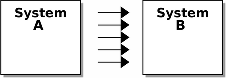
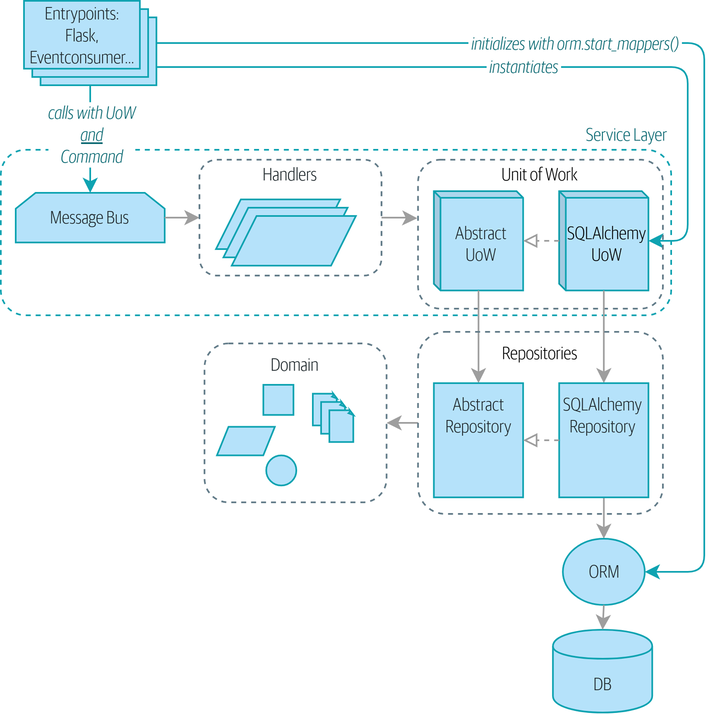

# Architecture Patterns with Python: Enabling Test-Driven Development, Domain-Driven Design, and Event-Driven Microservices

[Book](https://www.cosmicpython.com/book/preface.html) /
[Code examples](https://github.com/cosmicpython/code/)


## Introduction
> A big ball of mud is the natural state of software in the same way that wilderness is the natural state of your garden. It takes energy and direction to prevent the collapse.

### Encapsulation and Abstractions

Encapsulating behavior by using abstractions is a powerful tool for making code more expressive, more testable, and easier to maintain.

### Layering

In a layered architecture, we divide our code into discrete categories or roles, and we introduce rules about which categories of code can call each other.


### The Dependency Inversion Principle

1. High-level modules should not depend on low-level modules. Both should depend on abstractions.
2. Abstractions should not depend on details. Instead, details should depend on abstractions.


>The high-level modules of a software system are the functions, classes, and packages that deal with our real-world concepts.

>Low-level modules are the code that your organization doesn’t care about.

>*Depends* on doesn’t mean *imports* or *calls*, necessarily, but rather a more general idea that one module **knows** about or needs another module.


# Part 1: Building an Architecture to Support Domain Modeling
>Behavior should come first and drive our storage requirements


## 1. Domain modeling
> This is the part of your code that is closest to the business, the most likely to change, and the place where you deliver the most value to the business. Make it easy to understand and modify.
- The domain is a fancy way of saying the problem you’re trying to solve.
- A model is a map of a process or phenomenon that captures a useful property. The domain model is the mental map that business owners have of their businesses.
- DDD says that the most important thing about software is that it provides a useful model of a problem. If we get that model right, our software delivers value and makes new things possible.

> The name of our unit test describes the behavior that we want to see from the system, and the names of the classes and variables that we use are taken from the business jargon. We could show this code to our nontechnical coworkers, and they would agree that this correctly describes the behavior of the system.

- **Value Objects** are defined by their attributes and have no identity, meaning that their equality is based on the values of their attributes, not on an identity.

- **Entities** are objects that are distinct because of their identity, not just their attributes, meaning they are tracked through a unique identifier.

## 2. Repository Pattern


```
class AbstractRepository(abc.ABC):
    @abc.abstractmethod 
    def add(self, batch: model.Batch):
        raise NotImplementedError

    @abc.abstractmethod
    def get(self, reference) -> model.Batch:
        raise NotImplementedError
        
        
class SqlAlchemyRepository(AbstractRepository):
    def __init__(self, session):
        self.session = session

    def add(self, batch):
        self.session.add(batch)

    def get(self, reference):
        return self.session.query(model.Batch).filter_by(reference=reference).one()

    def list(self):
        return self.session.query(model.Batch).all()
```

- A simplifying abstraction over data storage -> allow us to decouple our model layer from the data layer
- **The Repository pattern** is an abstraction over persistent storage. It hides the boring details of data access by pretending that all of our data is in memory.
- The ORM imports (or "depends on" or "knows about") the domain model, and not the other way around. **Imperative Mapping** allows you to achieve this, not Declarative!
- Building fakes for your abstractions is an excellent way to get design feedback: if it’s hard to fake, the abstraction is probably too complicated.

>If your app is just a simple CRUD (create-read-update-delete) wrapper around a database, then you don’t need a domain model or a repository.

## 3. A Brief Interlude: On Coupling and Abstractions
Lots coupling:<br>


Less coupling:<br>

>The abstraction serves to protect us from change by hiding away the complex details of whatever system B does—we can change the arrows on the right without changing the ones on the left.


## 4. Our First Use Case: Flask API and Service Layer

> It often makes sense to split out a service layer, sometimes called an orchestration layer or a use-case layer.
### Typical service-layer functions have similar steps:

1. We fetch some objects from the repository.

2. We make some checks or assertions about the request against the current state of the world.

3. We call a domain service.

4. If all is well, we save/update any state we’ve changed.

>**Service Layer:** This layer acts as a mediator between the external requests and the domain logic. It orchestrates operations such as retrieving data from the database, updating the domain model, and persisting changes. The primary role of the service layer is to offload repetitive tasks, such as data handling and transaction management, from the business logic.

>**Domain Service:** This refers to logic that fits within the domain model but does not naturally belong to any stateful entity or value object. For example, in a shopping cart application, a domain service might be responsible for tax calculation. This service is stateless, focusing solely on the specific business rule (like calculating tax), without being tied to the data model's state.

## 5. TDD in High Gear and Low Gear

> Every line of code that we put in a test is like a blob of glue, holding the system in a particular shape. The more low-level tests we have, the harder it will be to change things.

**Aim for one end-to-end test per feature**
This might be written against an HTTP API, for example. The objective is to demonstrate that the feature works, and that all the moving parts are glued together correctly.

**Write the bulk of your tests against the service layer**
These edge-to-edge tests offer a good trade-off between coverage, runtime, and efficiency. Each test tends to cover one code path of a feature and use fakes for I/O. This is the place to exhaustively cover all the edge cases and the ins and outs of your business logic.

**Maintain a small core of tests written against your domain model**
These tests have highly focused coverage and are more brittle, but they have the highest feedback. Don’t be afraid to delete these tests if the functionality is later covered by tests at the service layer.

**Error handling counts as a feature**
Ideally, your application will be structured such that all errors that bubble up to your entrypoints (e.g., Flask) are handled in the same way. This means you need to test only the happy path for each feature, and to reserve one end-to-end test for all unhappy paths (and many unhappy path unit tests, of course).

- Express your service layer in terms of primitives rather than domain objects.


## 6. Unit of Work Pattern


```
def allocate(
    orderid: str, sku: str, qty: int,
    uow: unit_of_work.AbstractUnitOfWork,
) -> str:
    line = OrderLine(orderid, sku, qty)
    with uow: 
        batches = uow.batches.list() 
        ...
        batchref = model.allocate(line, batches)
        uow.commit() 
```
The UoW acts as a single entrypoint to our persistent storage, and it keeps track of what objects were loaded and of the latest state

#### This gives us three useful things:

1. A stable snapshot of the database to work with, so the objects we use aren’t changing halfway through an operation

2. A way to persist all of our changes at once, so if something goes wrong, we don’t end up in an inconsistent state

3. A simple API to our persistence concerns and a handy place to get a repository

```
class AbstractUnitOfWork(abc.ABC):
    batches: repository.AbstractRepository 

    def __exit__(self, *args): 
        self.rollback()  

    @abc.abstractmethod
    def commit(self): 
        raise NotImplementedError

    @abc.abstractmethod
    def rollback(self):
        raise NotImplementedError

DEFAULT_SESSION_FACTORY = sessionmaker( 
    bind=create_engine(
        config.get_postgres_uri(),
    )
)


class SqlAlchemyUnitOfWork(AbstractUnitOfWork):
    def __init__(self, session_factory=DEFAULT_SESSION_FACTORY):
        self.session_factory = session_factory

    def __enter__(self):
        self.session = self.session_factory()  # type: Session 
        self.batches = repository.SqlAlchemyRepository(self.session) 
        return super().__enter__()

    def __exit__(self, *args):
        super().__exit__(*args)
        self.session.close()

    def commit(self):  
        self.session.commit()

    def rollback(self): 
        self.session.rollback()
```

>Keep the life cycle of the session (and usually the transaction) separate and external. The most comprehensive approach, recommended for more substantial applications, will try to keep the details of session, transaction, and exception management as far as possible from the details of the program doing its work.

## 7. Aggregates and Consistency Boundaries


## Invariants, constraints and consistency
- **Constraint**: rule that restricts the possible states our model can get into
- **Invariant**: defined a little more precisely as a condition that is always true
- **Locks**: prevents two operations from happening simultaneously on the same row or same table

## What is Aggregate ?
An aggregate is just a domain object that contains other domain objects and lets us treat the whole collection as a single unit. 

The only way to modify the objects inside the aggregate is to load the whole thing, and to call methods on the aggregate itself.

>For example, if we’re building a shopping site, the Cart might make a good aggregate: it’s a collection of items that we can treat as a single unit. Importantly, we want to load the entire basket as a single blob from our data store. We don’t want two requests to modify the basket at the same time, or we run the risk of weird concurrency errors. Instead, we want each change to the basket to run in a single database transaction. We don’t want to modify multiple baskets in a transaction, because there’s no use case for changing the baskets of several customers at the same time. Each basket is a single consistency boundary responsible for maintaining its own invariants.

> An AGGREGATE is a cluster of associated objects that we treat as a unit for the purpose of data changes


### One Aggregate = One Repository
- The rule that repositories should only return aggregates is the main place where we enforce the convention that aggregates are the only way into our domain model. Be wary of breaking it!


### Optimistic Concurrency with Version Numbers


### Pessimistic Concurrency Control Example: SELECT FOR UPDATE
SELECT FOR UPDATE is a way of picking a row or rows to use as a lock (although those rows don’t have to be the ones you update). If two transactions both try to SELECT FOR UPDATE a row at the same time, one will win, and the other will wait until the lock is released.

### Recap
- Aggregates are your entrypoints into the domain model
By restricting the number of ways that things can be changed, we make the system easier to reason about.

- Aggregates are in charge of a consistency boundary
An aggregate’s job is to be able to manage our business rules about invariants as they apply to a group of related objects. It’s the aggregate’s job to check that the objects within its remit are consistent with each other and with our rules, and to reject changes that would break the rules.

- Aggregates and concurrency issues go together
When thinking about implementing these consistency checks, we end up thinking about transactions and locks. Choosing the right aggregate is about performance as well as conceptual organization of your domain.

# Part 2. Event-Driven Architecture
## 8. Events and The Message Bus

> Rule of thumb: if you can’t describe what your function does without using words like "then" or "and," you might be violating the SRP.

The Message Bus Maps Events to Handlers:
```
def handle(event: events.Event):
    for handler in HANDLERS[type(event)]:
        handler(event)


def send_out_of_stock_notification(event: events.OutOfStock):
    email.send_mail(
        "stock@made.com",
        f"Out of stock for {event.sku}",
    )


HANDLERS = {
    events.OutOfStock: [send_out_of_stock_notification],
}  # type: Dict[Type[events.Event], List[Callable]]
```

- **Events can help with the single responsibility principle**
Code gets tangled up when we mix multiple concerns in one place. Events can help us to keep things tidy by separating primary use cases from secondary ones. We also use events for communicating between aggregates so that we don’t need to run long-running transactions that lock against multiple tables.

- **A message bus routes messages to handlers**
You can think of a message bus as a dict that maps from events to their consumers. It doesn’t "know" anything about the meaning of events; it’s just a piece of dumb infrastructure for getting messages around the system.

- **Option 1: Service layer raises events and passes them to message bus**
The simplest way to start using events in your system is to raise them from handlers by calling bus.handle(some_new_event) after you commit your unit of work.

- **Option 2: Domain model raises events, service layer passes them to message bus**
The logic about when to raise an event really should live with the model, so we can improve our system’s design and testability by raising events from the domain model. It’s easy for our handlers to collect events off the model objects after commit and pass them to the bus.

- **Option 3: UoW collects events from aggregates and passes them to message bus**
Adding bus.handle(aggregate.events) to every handler is annoying, so we can tidy up by making our unit of work responsible for raising events that were raised by loaded objects. This is the most complex design and might rely on ORM magic, but it’s clean and easy to use once it’s set up.


## 9. Going to Town on the Message Bus.

Modified Message Bus handler. Now it invokes handlers and adding new Events from it to the queue
```
 def handle(
     event: events.Event,
     uow: unit_of_work.AbstractUnitOfWork,
 ):
     results = []
     queue = [event]
     while queue:
         event = queue.pop(0)
         for handler in HANDLERS[type(event)]:
             results.append(handler(event, uow=uow))
             queue.extend(uow.collect_new_events())
     return results
```

Modified API

```
@app.route("/allocate", methods=["POST"])
def allocate_endpoint():
    try:
         event = events.AllocationRequired(  #(2)
             request.json["orderid"], request.json["sku"], request.json["qty"]
         )
         results = messagebus.handle(event, unit_of_work.SqlAlchemyUnitOfWork())  #(3)
         batchref = results.pop(0)
    except InvalidSku as e:
```

Now the application is fully event-driven:

1. What used to be service-layer functions are now event handlers.

2. That makes them the same as the functions we invoke for handling internal events raised by our domain model.

3. We use events as our data structure for capturing inputs to the system, as well as for handing off of internal work packages.

4. The entire app is now best described as a message processor, or an event processor if you prefer. We’ll talk about the distinction in the next chapter.

Reallocation Flow<br>


#### What have we achieved?
- Events are simple dataclasses that define the data structures for inputs and internal messages within our system. This is quite powerful from a DDD standpoint, since events often translate really well into business language (look up event storming if you haven’t already).

- Handlers are the way we react to events. They can call down to our model or call out to external services. We can define multiple handlers for a single event if we want to. Handlers can also raise other events. This allows us to be very granular about what a handler does and really stick to the SRP.

Message Bus pros and cons:

| Pros                                                                    | Cons                                                                                                                                               |
|-------------------------------------------------------------------------|----------------------------------------------------------------------------------------------------------------------------------------------------|
| Handlers and services are the same thing, simplifying the architecture. | A message bus can be unpredictable from a web perspective; completion times are not predefined.                                                    |
| There is a well-structured data format for inputs to the system.        | There can be duplication between model objects and events, increasing maintenance costs. Adding a field often means modifying multiple structures. |


## 10. Commands and Command Handler

### Commands and Events

**Commands** are sent by one actor to another specific actor with the expectation that a particular thing will happen as a result. When we post a form to an API handler, we are sending a command. We name commands with imperative mood verb phrases like "allocate stock" or "delay shipment."

Commands capture intent. They express our wish for the system to do something. As a result, when they fail, the sender needs to receive error information.

Events are broadcast by an actor to all interested listeners. When we publish BatchQuantityChanged, we don’t know who’s going to pick it up. We name events with past-tense verb phrases like "order allocated to stock" or "shipment delayed."

| Attribute           | Event           | Command              |
|---------------------|-----------------|----------------------|
| **Named**           | Past tense      | Imperative mood      |
| **Error Handling**  | Fail noisily    | Fail independently   |
| **Sent to**         | All listeners   | One recipient        |

New handler for message bus:
```
Message = Union[commands.Command, events.Event]


def handle( 
    message: Message,
    uow: unit_of_work.AbstractUnitOfWork,
):
    results = []
    queue = [message]
    while queue:
        message = queue.pop(0)
        if isinstance(message, events.Event):
            handle_event(message, queue, uow) 
        elif isinstance(message, commands.Command):
            cmd_result = handle_command(message, queue, uow) 
            results.append(cmd_result)
        else:
            raise Exception(f"{message} was not an Event or Command")
    return results
```
 
>Events:
> 1. Events go to a dispatcher that can delegate to multiple handlers per event.
> 2. It catches and logs errors but doesn’t let them interrupt message processing.

>Commands:
> 1. The command dispatcher expects just one handler per command.
> 2. If any errors are raised, they fail fast and will bubble up.


Splitting commands and events, trade-offs:

| Pros                                                                                                        | Cons                                                                                                                                          |
|-------------------------------------------------------------------------------------------------------------|-----------------------------------------------------------------------------------------------------------------------------------------------|
| Treating commands and events differently clarifies what must succeed now versus what can be resolved later. | The subtle semantic differences between commands and events can lead to debates and confusion.                                                |
| Using explicit names like CreateBatch instead of BatchCreated makes user intentions clearer.                | Inviting failure by making it smaller and more isolated makes the system harder to reason about and increases the need for robust monitoring. |


## 11. Event-Driven Architecture: Using Event to Integrate Microservices


### Distributed Ball of Mud, and Thinking in Nouns
The style of architecture, where we create a microservice per database table and treat our 
HTTP APIs as CRUD interfaces to anemic models, is the most common initial way for people to approach service-oriented design.
This works fine for systems that are **very simple**, but it can quickly degrade into a **distributed ball of mud**.

### Error Handling in Distributed Systems

When two things have to be changed together, we say that they are coupled. We can think of 
this failure cascade as a kind of temporal coupling: every part of the system has to work at the same time for any part of it to work. As the system gets bigger, there is an exponentially increasing probability that some part is degraded.

- **Connascence** is a term used by some authors to describe the different types of coupling. Connascence isn’t bad, but some types of connascence are stronger than others. We want to have strong connascence locally, as when two classes are closely related, but weak connascence at a distance.
- **Connascence of Execution:** multiple components need to know the correct order of work for an operation to be successful
- **Connascence of Timing:** multiple things have to happen, one after another, for the operation to work
- **Connascence of Name:** multiple components need to agree only on the name of an event and the names of fields it carries.


### The Alternative: Temporal Decoupling Using Asynchronous Messaging
Microservices should be consistency boundaries. Between two services, we can accept eventual consistency, and that means we don’t need to rely on synchronous calls. Each service accepts commands from the outside world and raises events to record the result. Other services can listen to those events to trigger the next steps in the workflow.
>Why is this better? 
> 1. Things can fail independently, it’s easier to handle degraded behavior: we can still take orders if the allocation system is having a bad day.
> 2. We’re reducing the strength of coupling between our systems. If we need to change the order of operations or to introduce new steps in the process, we can do that locally.

### Using a Redis Pub/Sub Channel for Integration


### Internal Versus External Events
It’s a good idea to keep the distinction between internal and external events clear. Some events may come from the outside, and some events may get upgraded and published externally, but not all of them will. This is particularly important if you get into event sourcing (very much a topic for another book, though).

>Event notification is nice because it implies a low level of coupling, and is pretty simple to set up. It can become problematic, however, if there really is a logical flow that runs over various event notifications...It can be hard to see such a flow as it's not explicit in any program text....This can make it hard to debug and modify.

### Wrap Up

| Pros                                                                                | Cons                                                                   |
|-------------------------------------------------------------------------------------|------------------------------------------------------------------------|
| Avoids the distributed big ball of mud.                                             | The overall flows of information are harder to see.                    |
| Services are decoupled: it’s easier to change individual services and add new ones. | Eventual consistency is a new concept to deal with.                    |
|                                                                                     | Message reliability and choices around delivery need thinking through. |


## 12. Command-Query Responsibility Segregation (CQRS)


### Post/Redirect/Get and CQS
Command-query separation (CQS) - functions should either modify state or answer questions, 
but never both. This makes software easier to reason about: we should always be able to ask,
"Are the lights on?" without flicking the light switch.

>When building APIs, we can apply the same design technique by returning a 201 Created, or a 202 Accepted, with a Location header containing the URI of our new resources. What’s important here isn’t the status code we use but the logical separation of work into a write phase and a query phase.

>Splitting out your read-only views from your state-modifying command and event handlers is probably a good idea, even if you don’t want to go to full-blown CQRS.

### Your Domain Model Is Not Optimized for Read Operations
- If you’re building a simple CRUD app, reads and writes are going to be closely related, so you don’t need a domain model or CQRS. But the more complex your domain, the more likely you are to need both.

- Your domain classes will have multiple methods for modifying state, and you won’t need any of them for read-only operations.

>Because read replicas can be inconsistent, there’s no limit to how many we can have. If you’re struggling to scale a system with a complex data store, ask whether you could build a simpler read model.

- To reach better performance create table only for read operations, it will be denormalized way but increasing read speed:
```angular2html
From this:
            """
            SELECT ol.sku, b.reference
            FROM allocations AS a
            JOIN batches AS b ON a.batch_id = b.id
            JOIN order_lines AS ol ON a.orderline_id = ol.id
            WHERE ol.orderid = :orderid
            """
to this:
            """
            SELECT sku, batchref FROM allocations_view WHERE orderid = :orderid
            """

allocations_view = Table(
    "allocations_view",
    metadata,
    Column("orderid", String(255)),
    Column("sku", String(255)),
    Column("batchref", String(255)),
)
```
Using this table we avoid joins. But we need update this table when we update the main table (in different transactions).<br>


### Changing Our Read Model Implementation Is Easy
> Event handlers are a great way to manage updates to a read model, if you decide you need one. They also make it easy to change the implementation of that read model at a later date.

We can use Redis for read views.

| Option                                                          | Pros                                                                                                                                                                                   | Cons                                                                                                                                                           |
|-----------------------------------------------------------------|----------------------------------------------------------------------------------------------------------------------------------------------------------------------------------------|----------------------------------------------------------------------------------------------------------------------------------------------------------------|
| Just use repositories                                           | - Simple, consistent approach.                                                                                                                                                         | - Expect performance issues with complex query patterns.                                                                                                       |
| Use custom queries with your ORM                                | - Allows reuse of DB configuration and model definitions.                                                                                                                              | - Adds another query language with its own quirks and syntax.                                                                                                  |
| Use hand-rolled SQL to query your normal model tables           | - Offers fine control over performance with a standard query syntax.                                                                                                                   | - Changes to DB schema have to be made to your hand-rolled queries and your ORM definitions. Highly normalized schemas may still have performance limitations. |
| Add some extra (denormalized) tables to your DB as a read model | - A denormalized table can be much faster to query. If we update the normalized and denormalized ones in the same transaction, we will still have good guarantees of data consistency. | - It will slow down writes slightly.                                                                                                                           |
| Create separate read stores with events                         | - Read-only copies are easy to scale out. Views can be constructed when data changes so that queries are as simple as possible.                                                        | - Complex technique. Harry will be forever suspicious of your tastes and motives.                                                                              |


## 13. Dependency Injection (and Bootstrapping)

Without bootstrap:<br>
<br>
With bootstrap:<br>


### Preparing Handlers: Manual DI with Closures and Partials
```angular2html
# existing allocate function, with abstract uow dependency
def allocate(
    cmd: commands.Allocate,
    uow: unit_of_work.AbstractUnitOfWork,
):
    line = OrderLine(cmd.orderid, cmd.sku, cmd.qty)
    with uow:
        ...

# bootstrap script prepares actual UoW

def bootstrap(..):
    uow = unit_of_work.SqlAlchemyUnitOfWork()

    # prepare a version of the allocate fn with UoW dependency captured in a closure
    allocate_composed = lambda cmd: allocate(cmd, uow)

    # or, equivalently (this gets you a nicer stack trace)
    def allocate_composed(cmd):
        return allocate(cmd, uow)

    # alternatively with a partial
    import functools
    allocate_composed = functools.partial(allocate, uow=uow)  #(1)
```
later at runtime, we can call the partial function, and it will have
the UoW already bound
allocate_composed(cmd)

```angular2html
def send_out_of_stock_notification(
    event: events.OutOfStock,
    send_mail: Callable,
):
    send_mail(
        "stock@made.com",
        ...


# prepare a version of the send_out_of_stock_notification with dependencies
sosn_composed  = lambda event: send_out_of_stock_notification(event, email.send_mail)

```
later, at runtime:
sosn_composed(event)  # will have email.send_mail already injected in


### An Alternative Using Classes
```angular2html
# we replace the old `def allocate(cmd, uow)` with:

class AllocateHandler:
    def __init__(self, uow: unit_of_work.AbstractUnitOfWork):  #(2)
        self.uow = uow

    def __call__(self, cmd: commands.Allocate):  #(1)
        line = OrderLine(cmd.orderid, cmd.sku, cmd.qty)
        with self.uow:
            # rest of handler method as before
            ...

# bootstrap script prepares actual UoW
uow = unit_of_work.SqlAlchemyUnitOfWork()

# then prepares a version of the allocate fn with dependencies already injected
allocate = AllocateHandler(uow)

...
# later at runtime, we can call the handler instance, and it will have
# the UoW already injected
allocate(cmd)
```

### A Bootstrap script

We want our bootstrap script to do the following:

1. Declare default dependencies but allow us to override them

2. Do the "init" stuff that we need to get our app started

3. Inject all the dependencies into our handlers

4. Give us back the core object for our app, the message bus

```
def bootstrap(
    start_orm: bool = True,  #(1)
    uow: unit_of_work.AbstractUnitOfWork = unit_of_work.SqlAlchemyUnitOfWork(),  #(2)
    send_mail: Callable = email.send,
    publish: Callable = redis_eventpublisher.publish,
) -> messagebus.MessageBus:

    if start_orm:
        orm.start_mappers()

    dependencies = {"uow": uow, "send_mail": send_mail, "publish": publish}
    injected_event_handlers = {
        event_type: [
            inject_dependencies(handler, dependencies)
            for handler in event_handlers
        ]
        for event_type, event_handlers in handlers.EVENT_HANDLERS.items()
    }
    injected_command_handlers = {
        command_type: inject_dependencies(handler, dependencies)
        for command_type, handler in handlers.COMMAND_HANDLERS.items()
    }

    return messagebus.MessageBus(
        uow=uow,
        event_handlers=injected_event_handlers,
        command_handlers=injected_command_handlers,
    )
    
    def inject_dependencies(handler, dependencies):
    params = inspect.signature(handler).parameters
    deps = {
        name: dependency
        for name, dependency in dependencies.items()
        if name in params
    }
    return lambda message: handler(message, **deps)
```

### Even-More-Manual DI with Less Magic

```
injected_event_handlers = {
    events.Allocated: [
        lambda e: handlers.publish_allocated_event(e, publish),
        lambda e: handlers.add_allocation_to_read_model(e, uow),
    ],
    events.Deallocated: [
        lambda e: handlers.remove_allocation_from_read_model(e, uow),
        lambda e: handlers.reallocate(e, uow),
    ],
    events.OutOfStock: [
        lambda e: handlers.send_out_of_stock_notification(e, send_mail)
    ],
}
injected_command_handlers = {
    commands.Allocate: lambda c: handlers.allocate(c, uow),
    commands.CreateBatch: lambda c: handlers.add_batch(c, uow),
    commands.ChangeBatchQuantity: \
        lambda c: handlers.change_batch_quantity(c, uow),
}
```

### Using Bootstrap in Our Entrypoints

```
from allocation import bootstrap, views

app = Flask(__name__)
bus = bootstrap.bootstrap()


@app.route("/add_batch", methods=["POST"])
def add_batch():
     cmd = commands.CreateBatch(
         request.json["ref"], request.json["sku"], request.json["qty"], eta
     )
     bus.handle(cmd)
     return "OK", 201
```

### Wrap-Up

- Once you have more than one adapter, you’ll start to feel a lot of pain from passing dependencies around manually, unless you do some kind of dependency injection.

- Setting up dependency injection is just one of many typical setup/initialization activities that you need to do just once when starting your app. Putting this all together into a bootstrap script is often a good idea.

- The bootstrap script is also good as a place to provide sensible default configuration for your adapters, and as a single place to override those adapters with fakes for your tests.

- A dependency injection framework can be useful if you find yourself needing to do DI at multiple levels—if you have chained dependencies of components that all need DI, for example.


# Epilogue

> It’s fine if you have duplication in the use-case functions. We’re not trying to write perfect code; we’re just trying to extract some meaningful layers. It’s better to duplicate some code in a few places than to have use-case functions calling one another in a long chain.

### An Event-Driven Approach to Go to Microservices via Strangler Pattern

>The Strangler Fig pattern involves creating a new system around the edges of an old system, while keeping it running. Bits of old functionality are gradually intercepted and replaced, until the old system is left doing nothing at all and can be switched off.

**Eevent interception** to move functionality from one place to another. This is a three-step process:

1. Raise events to represent the changes happening in a system you want to replace.

2. Build a second system that consumes those events and uses them to build its own domain model.

3. Replace the older system with the new.

### Convincing Your Stakeholders to Try Something New
>We recommend domain modeling as a first step. In many overgrown systems, the engineers, product owners, and customers no longer speak the same language. Business stakeholders speak about the system in abstract, process-focused terms, while developers are forced to speak about the system as it physically exists in its wild and chaotic state.


## Summary Diagram


| Layer                              | Component                             | Description                                                                                                             |
|------------------------------------|---------------------------------------|-------------------------------------------------------------------------------------------------------------------------|
| **Domain**                         |                                       | Defines the business logic.                                                                                             |
|                                    | Entity                                | A domain object whose attributes may change but that has a recognizable identity over time.                             |
|                                    | Value object                          | An immutable domain object whose attributes entirely define it. It is fungible with other identical objects.            |
|                                    | Aggregate                             | Cluster of associated objects that we treat as a unit for the purpose of data changes. Defines a consistency boundary.  |
|                                    | Event                                 | Represents something that happened.                                                                                     |
|                                    | Command                               | Represents a job the system should perform.                                                                             |
| **Service Layer**                  |                                       | Defines the jobs the system should perform and orchestrates different components.                                       |
|                                    | Handler                               | Receives a command or an event and performs what needs to happen.                                                       |
| **Unit of work**                   |                                       | Abstraction around data integrity. Tracks new events on retrieved aggregates. Makes repositories available.             |
| **Message bus (internal)**         |                                       | Handles commands and events by routing them to the appropriate handler.                                                 |
| **Adapters (Secondary)**           |                                       | Concrete implementations of an interface that goes from our system to the outside world (I/O).                          |
|                                    | Repository                            | Abstraction around persistent storage. Each aggregate has its own repository.                                           |
|                                    | Event publisher                       | Pushes events onto the external message bus.                                                                            |
| **Entrypoints (Primary adapters)** |                                       | Translate external inputs into calls into the service layer.                                                            |
|                                    | Web                                   | Receives web requests and translates them into commands, passing them to the internal message bus.                      |
|                                    | Event consumer                        | Reads events from the external message bus and translates them into commands, passing them to the internal message bus. |
| **N/A**                            | External message bus (message broker) | A piece of infrastructure that different services use to intercommunicate, via events.                                  |
