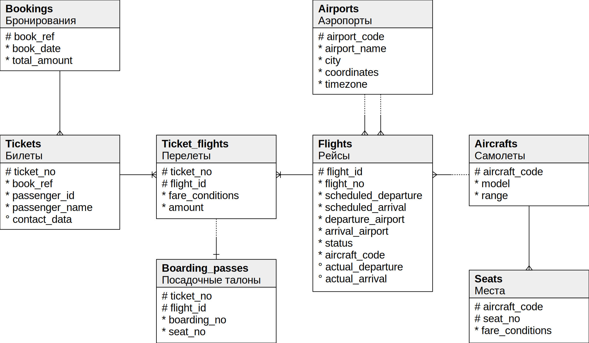

## 1.1 Data Organization in PostgreSQL

#### Databases and Cluster:

PostgreSQL is a database management system (DBMS), and an instance of it is called a PostgreSQL server.
The server manages data stored in databases, which together form a cluster.
To use a cluster, it needs to be initialized by specifying a directory for storing files (PGDATA).

#### Cluster Initialization:

During initialization, three databases are created:

- template0 — for recovery and creating a database in another encoding.
- template1 — a template for new databases.
- postgres — a regular database for user use.

#### System Catalog:

Stores metadata about all cluster objects (tables, indexes, functions, etc.).
Each database has its own set of system catalog tables.
The system catalog is accessible via SQL queries and DDL commands.
Schemas:

#### Namespaces for objects in a database.

Special schemas include:

- public — default for user objects.
- pg_catalog — for the system catalog.
- information_schema — SQL standard.
- pg_toast — for storing large attributes.
- pg_temp — for temporary tables.

#### Tablespaces:

- Define the physical location of data.
- During initialization, two tablespaces are created:
    - pg_default — default tablespace.
    - pg_global — for shared system catalog objects.
- User tablespaces are specified during creation.

#### Relations:

Primary database objects, such as tables and indexes, consist of rows.
All objects (tables, indexes, views) are called relations.

#### Forks and Files:

- Data is organized into forks, each represented by files.
- The main fork contains the actual data.
- Additional forks include:
    - init fork — for unlogged tables.
    - free space map (fsm) — tracks free space.
    - visibility map (vm) — tracks visibility for vacuum and freeze operations.

#### Pages:

Files are divided into pages (usually 8 KB) to facilitate data I/O.

#### TOAST:

- Technology for storing long rows that don't fit on a single page.
- Long values can be compressed or stored in a separate toast table.
- Compression algorithms: PGLZ and LZ4 (LZ4 is faster and more resource-efficient).
-

#### Recommendations:

Storing large amounts of data in PostgreSQL is not ideal, especially if transactional logic is unnecessary.
For such data, it's better to use the file system, keeping only file paths in the database.

## 1.2 Processes and Memory in PostgreSQL

Server Instance:

A PostgreSQL server instance consists of several interacting processes.
The primary process, traditionally called postmaster, is the first to start when the server starts.
postmaster launches all other processes and monitors them, restarting them if they crash.
The process model in PostgreSQL has been used since the project's inception due to its simplicity.
Discussions about switching to a threaded model continue due to the potential benefits, but such a transition would require
significant changes and time.

#### Key Service Processes:

- startup: Recovers the system after failures.
- autovacuum: Cleans tables and indexes of obsolete data.
- wal writer: Writes journal records to disk.
- checkpointer: Creates checkpoints.
- writer: Writes dirty pages to disk.
- wal sender: Sends journal records to a replica.
- wal receiver: Receives journal records on a replica.
- Configuration and Memory Management:

Each process is managed by configuration parameters, sometimes dozens of them.
Proper server configuration requires a good understanding of its internal workings.
Initial parameter values are chosen based on general considerations and then refined using monitoring feedback.
To facilitate process communication, postmaster allocates shared memory accessible to all processes.

#### Caching:

Disks (both HDD and SSD) are significantly slower than RAM, so caching is used.
Recently read pages are stored in RAM, and modified data is written to disk with a delay.
The buffer cache takes up most of the shared memory, containing other buffers that accelerate disk operations.
The operating system also has its own cache, resulting in double caching.
PostgreSQL rarely uses direct I/O, so it relies on the OS cache as well.

#### Handling Crashes:

In the event of a crash (e.g., power failure or OS crash), the contents of RAM, including the buffer cache, are lost.
Disk files may contain pages written at different times, necessitating data consistency restoration.
PostgreSQL maintains a write-ahead log (WAL) to replay lost operations and ensure data consistency.

## 1.3 Clients and Client-Server Protocol

#### Postmaster and Client Connections:

One of the responsibilities of the postmaster process is to listen for incoming connections.
When a new client connection is detected, postmaster spawns a backend process to handle it.
The client establishes a connection and starts a session with its server process, which lasts until the client disconnects or the
connection is interrupted.

#### Handling Multiple Clients:

Each client gets its own backend process on the server.
High numbers of connections can cause issues:
Each process needs memory for caching system catalog data, prepared queries, intermediate query results, and other data. More
connections require more available memory.
Frequent connections and short sessions (where the client performs a small query and disconnects) consume excessive resources on
connection setup, process creation, and cache population.
More processes increase the time needed to manage the process list, potentially reducing performance as the number of clients
grows.

#### Connection Pooling:

To mitigate these issues, connection pooling is used to limit the number of backend processes.
PostgreSQL lacks built-in connection pooling, so third-party solutions are used, such as PgBouncer or Odyssey.
Typically, a single server process handles transactions from different clients sequentially.
This imposes certain limitations on application development, as only transaction-local resources can be used, not session-local
ones.

#### Client-Server Protocol:

Clients and servers must use the same protocol to communicate. The standard library for this is libpq, though independent
implementations exist.
Generally, the protocol allows the client to connect to the server and execute SQL queries.

#### Connection Details:

Connections are always made under a specific role (user) and to a specific database.
Although the server operates with a database cluster, applications must connect separately to each database they use.
Authentication ensures that the user is who they claim to be (e.g., by asking for a password) and verifies their permissions to
connect to the server and the selected database.

#### SQL Query Execution:

SQL queries are sent to the backend process in text form.
The process parses, optimizes, executes the query, and returns the result to the client.

# 2. Isoaltion

### 2.1 Consistency

An important feature of relational DBMSs is ensuring consistency, meaning data correctness.

#### Integrity Constraints:

Databases can enforce integrity constraints such as NOT NULL or UNIQUE to maintain data integrity.
The DBMS ensures that data never violates these constraints.

#### Consistency vs. Integrity:

Consistency is stricter than integrity. Some conditions are too complex to be defined at the database level, involving multiple
tables or other considerations.
The DBMS cannot inherently understand all application-specific consistency rules. If an application violates consistency without
breaking integrity constraints, the DBMS won't detect it.
Thus, applications must ensure they maintain consistency.

#### Role of the DBMS:

Even correct sequences of operations can temporarily violate consistency. For example, transferring funds between accounts
involves two operations: deducting from one account and adding to another. The first operation violates consistency until the
second operation restores it.
If a failure occurs after the first operation but before the second, consistency is broken. The DBMS can handle this by treating
these operations as an indivisible transaction.

#### Concurrent Transactions:

Correct individual transactions can interact incorrectly when executed concurrently, leading to anomalies.
For instance, transactions should not see changes from other uncommitted transactions to avoid anomalies like dirty reads.
The DBMS must isolate transactions from each other to prevent anomalies and ensure that the result of concurrent execution matches
one of the possible sequential executions.

#### Transaction Definition:

A transaction is a set of operations that move the database from one consistent state to another, assuming it completes fully (
atomicity) and without interference from other transactions (isolation).
This definition encompasses the first three letters of the ACID acronym: Atomicity, Consistency, Isolation. Durability is also
crucial, as system crashes require dealing with changes from uncommitted transactions to restore consistency.

#### Isolation Levels and Anomalies:

Full isolation is technically challenging and impacts performance, so DBMSs often use weakened isolation levels that prevent some,
but not all, anomalies.
Applications need to understand the isolation level used, its guarantees, and its limitations to write correct code.

## 2.2 Isolation Levels and Anomalies in the SQL Standard

The SQL standard describes four isolation levels, defined by the anomalies they allow or disallow. Understanding isolation levels
requires understanding these anomalies first.

#### Lost Update

The lost update anomaly occurs when two transactions read the same row, and then both update it based on the initial value,
resulting in one update being lost. For example, if two transactions both plan to add 100 to an account with 1000 units, each
reads the initial 1000 units. The first transaction updates it to 1100 units, then the second transaction updates it to 1100 units
again, effectively losing one of the updates.

The SQL standard does not allow lost updates at any isolation level.

#### Dirty Read and Read Uncommitted

A dirty read occurs when a transaction reads uncommitted changes made by another transaction. For example, one transaction
transfers 100 units to an account but does not commit. Another transaction reads this uncommitted balance and allows withdrawal,
even though the first transaction might roll back, leaving the account with no funds.

Dirty reads are allowed at the Read Uncommitted isolation level.

#### Non-Repeatable Read and Read Committed

A non-repeatable read happens when a transaction reads the same row twice and finds different values because another transaction
has modified and committed the row in between the reads. For example, one transaction checks an account balance, finding 1000
units, and plans a withdrawal. Meanwhile, another transaction reduces the balance to zero and commits. The first transaction, if
it does not recheck, might cause an overdraft.

Non-repeatable reads are allowed at the Read Uncommitted and Read Committed levels.

#### Phantom Read and Repeatable Read

A phantom read occurs when a transaction reads a set of rows based on a condition, and another transaction inserts new rows that
match the condition and commits. When the first transaction re-reads, it finds additional rows. For example, if a rule limits a
client to three accounts, one transaction checks and finds two accounts. Meanwhile, another transaction opens a third account and
commits. The first transaction, without rechecking, might open a fourth account, violating the rule.

Phantom reads are allowed at the Read Uncommitted, Read Committed, and Repeatable Read levels.

#### Serializable Level

The Serializable isolation level prevents all anomalies, ensuring that the outcome of concurrent transactions matches one of the
possible sequential executions. This level guarantees that if transactions are correct individually, they will remain correct when
executed concurrently.

#### Here is the standard table of anomalies and isolation levels, with an additional column for clarity:

Anomaly Read Uncommitted Read Committed Repeatable Read Serializable

| Anomaly              | Read Uncommitted | Read Committed | Repeatable Read | Serializable |
|----------------------|------------------|----------------|-----------------|--------------|
| Lost Updates         | No               | No             | No              | No           |
| Dirty Reads          | Yes              | No             | No              | No           |
| Non-Repeatable Reads | Yes              | Yes            | No              | No           |
| Phantom Reads        | Yes              | Yes            | Yes             | No           |
| Other Anomalies      | Yes              | Yes            | Yes             | No           |

#### Why These Anomalies?

The SQL standard lists only a few anomalies, possibly because when the standard was first developed, other anomalies were not well
understood. The standard assumes isolation through locking. In practice:

- Read Uncommitted: Modifying rows are locked for changes but not for reading, allowing dirty reads.
- Read Committed: Rows are locked for both reading and writing, preventing dirty reads but allowing non-repeatable reads.
- Repeatable Read: Rows are locked for all operations, preventing non-repeatable reads but allowing phantom reads.
- Serializable: Requires predicate locking, where not just rows but the conditions for data are locked. However, practical
  predicate locking is limited by the complexity of the conditions.

Understanding these levels and the guarantees they provide is crucial for writing correct applications that maintain data
consistency.

## 2.3 Isolation Levels in PostgreSQL

### Snapshot Isolation (SI)

Snapshot Isolation (SI) is a transaction management protocol where each transaction operates on a consistent snapshot of the
database at a certain point in time. It includes all committed changes before the snapshot's creation. This approach minimizes
locks, blocking only repeated modifications to the same row. Write transactions never block read transactions, and reads never
block any transaction.

### Multi-Version Concurrency Control (MVCC)

PostgreSQL implements a multi-version variant of SI, allowing multiple versions of the same row to coexist. This prevents
transaction interruptions due to reading outdated data. MVCC ensures data visibility based on transaction timestamps.

### Isolation Levels

- Read Committed: This level avoids dirty reads but allows non-repeatable reads and phantom reads. Transactions see only committed
  data, but changes between operations can lead to inconsistencies.

- Repeatable Read: Prevents non-repeatable and phantom reads, ensuring consistent data visibility within a transaction. However,
  if concurrent updates occur, transactions may face serialization errors and need to be retried.

- Serializable: The strictest level, preventing all anomalies, including write skews and read-only transaction anomalies. It
  ensures full transaction isolation by detecting and aborting conflicting transactions, but this can lead to increased overhead
  and false positives.

#### Practical Implications

- Read Committed: Suitable for general use but requires caution to avoid making decisions based on possibly outdated data.
- Repeatable Read: Ensures stable data reads within a transaction but needs handling of potential serialization errors.
- Serializable: Provides the highest isolation level but may require transaction retries due to serialization errors, impacting
  performance.

#### Code Practices

- Avoid procedural checks: Use declarative constraints to ensure data integrity.
- Single SQL statements: Minimize intermediate states by using comprehensive SQL queries.
- User-defined locks: As a last resort, manual locks can ensure consistency but reduce concurrency benefits.

| Anomaly              | Read Committed | Repeatable Read | Serializable |
|----------------------|----------------|-----------------|--------------|
| Lost Updates         | Yes            | No              | No           |
| Dirty Reads          | No             | No              | No           |
| Non-Repeatable Reads | Yes            | No              | No           |
| Phantom Reads        | Yes            | No              | No           |
| Other Anomalies      | Yes            | Yes             | No           |

#### Conclusion

Choosing the right isolation level depends on the application's concurrency needs and tolerance for transaction overhead.
Serializable offers the best consistency but at a performance cost, while Read Committed balances performance with some risk of
anomalies. Repeatable Read provides a middle ground, requiring careful handling of serialization errors.

## 2.4 Which Isolation Level to Use?

### Read Committed:

Default Level: PostgreSQL uses Read Committed by default, and it is likely the most used isolation level in applications.

- Advantages: It does not cause transaction aborts due to consistency issues, except in case of a failure. There's no need to
  handle serialization errors or transaction retries.
- Disadvantages: A high number of possible anomalies can occur, which requires developers to be constantly aware and to write code
  that avoids these issues. Testing for these errors is challenging because they can be unpredictable and difficult to reproduce
  and fix.

### Repeatable Read:

- Advantages: It addresses some consistency issues but not all. It is beneficial for read-only transactions and can be used
  effectively for reporting that involves multiple SQL queries.
- Disadvantages: Developers must still handle remaining anomalies and be prepared for serialization errors. Applications need to
  be modified to handle these errors correctly, which adds complexity.

### Serializable:

- Advantages: This level ensures the highest consistency, removing the need to worry about inconsistencies. It simplifies coding
  as developers do not need to consider concurrency anomalies.
- Disadvantages: Applications must be able to retry any transaction that encounters a serialization error. The overhead and the
  percentage of aborted transactions can significantly reduce throughput. Additionally, this level is not applicable on replicas
  and cannot be mixed with other isolation levels.

### Conclusion

Read Committed: Suitable for most applications due to its simplicity and lack of serialization errors, but requires careful coding
to avoid anomalies.
Repeatable Read: Best for read-heavy transactions or scenarios where some anomalies need to be avoided, but developers must handle
serialization errors.
Serializable: Ideal for scenarios requiring strict consistency, but requires handling of transaction retries and comes with
performance trade-offs.

## 3. Pages and raw versions.

## 3.1. Page Structure

Each page in PostgreSQL is structured with several distinct sections:

- Header: Located at the lower addresses, storing metadata such as checksums and sizes of other areas.
- Array of Pointers to Row Versions: Acts as the table of contents for the page.
- Free Space: Available space for new data.
- Row Versions: Actual data entries with some additional metadata.
- Special Area: Reserved for specific index types to store auxiliary information.

### Page Header

The page header has a fixed size and contains critical information about the page. Using the pageinspect extension, one can
retrieve details of a page header:

```sql
CREATE
EXTENSION pageinspect;
SELECT lower, upper, special, pagesize
FROM page_header(get_raw_page('accounts', 0));
```

#### Special Area

Located at the higher addresses, the special area is used mainly by certain index types for additional information. For table
pages, this area is typically zero-sized.

#### Row Versions

Each row in PostgreSQL is actually a row version, allowing multiple versions of the same row to coexist. This helps in
implementing Multi-Version Concurrency Control (MVCC).

#### Pointers to Row Versions

The array of pointers to row versions serves as an index within the page. Each pointer, occupying 4 bytes, includes:

- Offset of the row version from the beginning of the page
- Length of the row version
- Status bits indicating the row's state

#### Free Space

Located between the pointer array and the row versions, this space is available for new data without causing fragmentation.

## 3.2. Row Version Structure

A row version consists of a header followed by the actual data. The header includes fields like:

- xmin, xmax: Transaction IDs that created and invalidated the row version, respectively.
- infomask: Various status bits.
- ctid: Pointer to the next version of the same row.
- NULL bitmap: Marks columns that have NULL values.
  Row versions are stored on disk in the same format as in memory, making PostgreSQL data files platform-dependent due to
  differences in byte order and data alignment across architectures.

## 3.3. Operations on Row Versions

### Insertion

When inserting a row, its xmin is set to the current transaction ID, and xmax is set to 0, indicating it's valid. Example:

```sql
BEGIN;
INSERT INTO t(s)
VALUES ('FOO');
SELECT pg_current_xact_id(); -- Returns transaction ID, e.g., 773
SELECT *
FROM heap_page('t', 0);
```

After committing, the transaction status is recorded in the commit log (clog).

### Deletion

When deleting a row, its xmax is set to the current transaction ID, indicating it is deleted:

```sql
BEGIN;
DELETE
FROM t;
SELECT pg_current_xact_id(); -- Returns transaction ID, e.g., 774
SELECT *
FROM heap_page('t', 0);
```

### Update

An update operation is a combination of delete and insert, creating a new row version:

```sql
BEGIN;
UPDATE t
SET s = 'BAR';
SELECT pg_current_xact_id(); -- Returns transaction ID, e.g., 775
SELECT *
FROM t;
SELECT *
FROM heap_page('t', 0);
```

After committing, the old row version is invalidated, and a new version is created.

## 3.4. Indexes

In PostgreSQL, indexes never contain multiple versions of the same row. Each row is represented by a single entry, and index
entries do not include the xmin and xmax fields. Index entries point to all possible versions of table rows, and transactions must
check the table to determine the visible version, unless the page is marked in the visibility map.

Using tools like pageinspect, you can inspect index pages and see pointers to both current and previous versions of table rows.
For example, after an update, the index might show entries for both the new and old versions of a row, reflecting the changes in
the sorted order of the index.

## 3.5. TOAST

A TOAST table is essentially a regular table with its own versioning system, which is separate from the versioning of the main
table's rows. The way TOAST tables work internally ensures that rows are never updated but only added or deleted. This makes the
versioning in TOAST somewhat degenerate.

#### Data Updates and Versioning

When data changes, a new version of the row is always created in the main table. If the update does not affect the "long" value
stored in the TOAST table, the new version of the row will still reference the previous value in the TOAST table. Only when an
update changes the "long" value will both a new version of the row in the main table and new TOAST entries be created.

## 3.6. Virtual Transactions

PostgreSQL employs an optimization technique to conserve transaction IDs. If a transaction is read-only, it does not affect the
visibility of row versions. Therefore, the servicing process initially assigns a virtual transaction ID (virtual xid) to the
transaction. This ID consists of the identifier of the servicing process and a sequential number. Assigning this ID does not
require synchronization among all processes and is thus performed very quickly.

#### Virtual Transaction IDs

A virtual transaction does not have a real transaction ID yet:
At different times, the system may contain virtual transactions with IDs that have already been used. This is normal because
virtual transaction IDs exist only in memory while the transaction is active; they are never written to data pages or stored on
disk.

#### Transition to Real Transaction IDs

If a transaction starts modifying data, it is then assigned a real, unique transaction ID.

## 3.7. Nested Transactions

### Savepoints in SQL

SQL defines savepoints that allow rolling back part of a transaction without aborting it entirely. This does not fit into the
usual transaction scheme since the transaction status is singular for all changes, and physically no data is rolled back.

To implement this functionality, a transaction with a savepoint is divided into several nested transactions (subtransactions),
each with its own status that can be managed independently. Nested transactions have their own numbers, higher than the main
transaction number. The status of nested transactions is recorded in the clog as usual, but committed nested transactions are
marked with two bits: committed and aborted. The final status depends on the status of the main transaction—if the main
transaction is aborted, all nested transactions are considered aborted as well.

### Storage and Management

Information about nested transactions is stored in files within the PGDATA/pg_subtrans directory. Access to these files is managed
through shared memory buffers organized similarly to clog buffers.

### Differences from Autonomous Transactions

Nested transactions should not be confused with autonomous transactions. Autonomous transactions are independent of each other,
unlike nested transactions. Autonomous transactions do not exist in standard PostgreSQL, which is generally seen as beneficial
since they are rarely needed and their presence in other database systems often leads to misuse.

Example Workflow

1. Start a transaction and insert a row:
    - A new row is added, and the current transaction ID is noted.
2. Set a savepoint and insert another row:
    - A savepoint is set, and another row is inserted. The main transaction ID remains the same.
3. Rollback to the savepoint and insert a third row:
    - The transaction rolls back to the savepoint, and a new row is inserted.

In the page view, the row added by the aborted nested transaction is still visible. Once changes are committed, it is evident that
each nested transaction has its own status.

### Error Handling and Atomicity

If an error occurs during an operation, the transaction is considered aborted, and no further operations are allowed within it.
Attempting to commit such a transaction will result in a rollback. This behavior ensures atomicity, preventing partial access to
changes made before the error.

In PostgreSQL's interactive terminal (psql), there is a mode that allows continuing a transaction after an error by implicitly
rolling back to a savepoint before each command. This mode is not enabled by default due to the significant overhead associated
with setting savepoints.

# 4. Data Snapshots

## 4.1. What is a Data Snapshot?

Physically, data pages can contain multiple versions of the same row, but each transaction should see at most one of them. All the
versions of different rows observed by a transaction form a data snapshot. A snapshot ensures a consistent view of the data in the
ACID sense at a specific point in time, containing only the most up-to-date data committed at the moment of its creation.

To ensure isolation, each transaction works with its own snapshot. Different transactions see different, yet consistent (at
different points in time) data.

### Isolation Levels and Snapshots

- Read Committed Level: A snapshot is created at the beginning of each transaction's statement and remains active for the duration
  of that statement.

- Repeatable Read and Serializable Levels: A snapshot is created once at the beginning of the first statement in the transaction
  and remains active until the end of the transaction.

This mechanism ensures that each transaction has a stable view of the data according to the isolation level it operates under.

## 4.2. Visibility of Row Versions in a Snapshot

A data snapshot is not a physical copy of all necessary row versions. Instead, it is defined by a few numbers, and the visibility
of row versions in the snapshot is determined by specific rules.

### Determining Visibility

Whether a row version is visible in a snapshot depends on the xmin and xmax fields of its header (the transaction IDs that created
and deleted the version) and the corresponding information bits. The xmin–xmax intervals do not overlap, so each row is
represented by at most one version in any snapshot.

### Simplified Visibility Rules

1. Visible Version: A row version is visible if the changes made by the transaction xmin are visible in the snapshot, and the
   changes made by the transaction xmax are not visible. This means the row version has been created but not yet deleted.

2. Visible Changes: Changes made by a transaction are visible in a snapshot if the transaction was committed before the snapshot
   was created.

3. Own Changes: A transaction sees its own uncommitted changes in its snapshot.

4. Aborted Transactions: Changes from aborted transactions are not visible in any snapshot.

These rules ensure that each snapshot provides a consistent view of the database at the time of its creation, respecting the ACID
properties.

## 4.3. Composition of a Snapshot

### Snapshot Information

In PostgreSQL, a snapshot is not seen as a physical copy of all required row versions. Instead, it is defined by several numbers,
and visibility of row versions is determined by specific rules. The system only knows when transactions started (defined by
transaction ID) but does not record the exact moment of their completion. Commit time is tracked if the track_commit_timestamp
parameter is enabled, but this information is not used for visibility checks.

### Snapshot Data

A snapshot contains:

1. Lower Boundary (xmin): The transaction ID of the oldest active transaction. Transactions with IDs less than xmin are either
   committed (and their changes are visible) or aborted (and their changes are ignored).
2. Upper Boundary (xmax): One more than the transaction ID of the last committed transaction. Transactions with IDs greater than
   or equal to xmax are either not finished or do not exist, so their changes are not visible.
3. List of Active Transactions (xip_list): Contains IDs of all active transactions (less than xmax), excluding virtual
   transactions.

### Visibility Determination

When a snapshot is created, it records the status of transactions at that moment. Without this information, it would be impossible
to determine which row versions should be visible in the snapshot. Therefore, PostgreSQL cannot create a snapshot showing
consistent data for a past moment since it cannot retrospectively know the transaction statuses.

#### Example Workflow

1. Create a Table and Insert Rows:

    - Transaction 1 inserts a row and remains active.
    - Transaction 2 inserts another row and commits.
2. Create a Snapshot:

    - A new session creates a snapshot and captures the current state.
3. Commit the First Transaction:

    - The first transaction is committed after the snapshot is taken.
4. Modify Rows in a New Transaction:

    - Transaction 3 modifies the second row, creating a new version.

#### Snapshot Composition

When a snapshot is created, it consists of:

- xmin (the oldest active transaction ID),
- xmax (one more than the last committed transaction ID),
- xip_list (list of active transaction IDs).

#### Visibility in Snapshot

- Changes from transactions with xid < xmin are always visible.
- Changes from transactions with xmin ≤ xid < xmax are visible unless they are in xip_list.

#### Example Visibility Analysis

- The first row (transaction 787) is not visible because it is still active.
- The second row (created by transaction 788) is visible since it is committed and falls within the snapshot range.
- The latest version of the second row (modified by transaction 789) is not visible as it was created after the snapshot was
  taken.

## 4.4. Visibility of Own Changes

#### Complexity of Visibility

Determining the visibility of a transaction's own changes can be complex because there can be situations where only a part of the
changes should be visible. For instance, a cursor opened at a certain point in time should not see subsequent changes regardless
of the isolation level.

To handle this, the row version header includes a special field displayed in the pseudo-columns cmin and cmax. The cmin column
represents the sequence number of the insertion operation within the transaction, and cmax represents the deletion operation.
However, to save space in the row header, this is actually a single field. It is rare for a row to be inserted and deleted in the
same transaction. If this does happen, a special "combo number" is recorded in the same field, with the servicing process
remembering the real cmin and cmax.

## 4.5. Transaction Horizon

### Definition and Importance of Transaction Horizon

The lower boundary of a snapshot (the xmin of the oldest transaction active at the time of its creation) is crucial as it defines
the transaction horizon for the transaction using this snapshot.

- Without an Active Snapshot: The horizon of a transaction (such as those with Read Committed isolation level between statements)
  is defined by its own transaction ID, if assigned.
- Beyond the Horizon: All transactions with IDs less than xmin are guaranteed to be committed, meaning the transaction always sees
  only the current versions of rows beyond its horizon.
  This concept is inspired by the event horizon in physics.

#### Viewing the Transaction Horizon

PostgreSQL tracks the current horizon of transactions for all processes. A transaction can see its own horizon in the
pg_stat_activity table.

Virtual transactions, although lacking real transaction IDs, use snapshots similarly to regular transactions and have their own
horizons. Virtual transactions without an active snapshot do not have a meaningful horizon and are transparent regarding snapshots
and visibility.

#### Database Horizon

The database horizon is determined by taking the horizons of all transactions working with the database and identifying the oldest
xmin. This horizon ensures that outdated row versions beyond this point are no longer visible to any transaction and can be safely
removed during cleanup. Therefore, the concept of the horizon is essential for practical database maintenance.

#### Implications

- Long-Running Transactions: Transactions with Repeatable Read or Serializable isolation levels that run for extended periods hold
  the database horizon, preventing cleanup.
- Read Committed Transactions: A Read Committed transaction holds the database horizon whether it is actively executing a
  statement or idle within the transaction.
- Virtual Read Committed Transactions: These transactions hold the horizon only while executing statements.

#### Best Practices

- Avoid Long Transactions with Active Updates: Mixing active updates (which generate row versions) with long transactions should
  be avoided to prevent table and index bloat.
  By understanding and managing transaction horizons effectively, database performance and maintenance can be optimized.

# 5. In-Page Cleanup and HOT Updates

## 5.1. In-Page Cleanup

#### Conditions for In-Page Cleanup:

- Insufficient Space: A previous update couldn't fit a new row version on the same page.
- Fill Factor Exceeded: The page is filled beyond the fillfactor threshold.

#### Process:

- Insertion and Updates: New rows are inserted only if the page is less than fillfactor full. Remaining space is reserved for
  updates.
- Cleanup Trigger: Removes row versions not visible in any snapshot, confined to a single page, and performs quickly.

#### Implications:

- Index Pointers: Pointers to removed row versions remain due to index references.
- Visibility Map: Not updated during cleanup; space freed is used for updates, not inserts.
- Page Changes during Reads: A SELECT can trigger cleanup, altering the page structure.

In-page cleanup ensures efficient storage by retaining only necessary row versions and effectively managing free space within
pages.

## 5.2. HOT Updates

### Overview

Holding index references for all versions of each row is inefficient because:

- Index Updates: Every row change requires updating all indexes on the table, even if the changed columns aren't indexed.
- Index Cleanup: Indexes accumulate references to historical row versions, which then need to be cleaned up.

### HOT (Heap-Only Tuple) Updates address this inefficiency by optimizing updates when:

- No indexes are created on the table.
- The updated columns are not used in any index.
  T- he values of the updated columns in the index do not change.

### HOT Update Conditions

- No Indexes: Any update will be a HOT update.
- Indexes Present: Updates are HOT if the updated columns are not part of any index or their values do not change.

### Mechanism

- Index References: Only the first version of a row has an index entry.
- Row Version Chain: Subsequent versions within the same page are linked via the ctid pointers in their headers.
- HOT Flags: The first version is marked with Heap Hot Updated, and intermediate versions are marked with Heap Only Tuple.
- During an index scan, if the server encounters a Heap Hot Updated row, it follows the chain to find the visible version.

### Practical Example

- Initial State:
    - Create a table with a fillfactor of 75%.
    - Insert and update rows multiple times, creating a chain of versions on the same page.
- Index References:
    - The index holds only one reference to the "head" of the chain.
- Updates and Chains:
    - Multiple updates grow the chain within the same page.
- Performance:
    - HOT update chains do not span multiple pages, ensuring efficient performance without additional page accesses.

## 5.3. In-Page Cleanup for HOT Updates

### Importance of In-Page Cleanup with HOT Updates

In-page cleanup is particularly significant during HOT (Heap-Only Tuple) updates. When updates occur and the fillfactor threshold
is exceeded, in-page cleanup ensures efficient use of space while maintaining index integrity.

### HOT Update Mechanism

1. Maintaining the "Head" of HOT Chain:
    - The initial row version referenced by the index must remain in place.
    - Subsequent row versions in the update chain can be freed if there are no external references to them.
2. Double Addressing:
    - The index-referenced pointer (e.g., (0,1)) is redirected to the current head of the update chain.
    - Freed pointers are marked as unused, ensuring no space is wasted.

### Example Process

1. Initial Cleanup:

    - Exceeding the fillfactor triggers cleanup.
    - The head pointer is redirected, and other pointers are freed.
2. Subsequent Updates:

    - Each new update adds to the HOT chain within the page.
    - Further updates trigger additional cleanups, maintaining efficient space use.

## 5.4. Breaking the HOT Chain

#### Scenario of HOT Chain Break

When a page runs out of free space to store a new row version, the HOT chain breaks. This necessitates placing the new row version
on a different page, requiring a new index reference.

## 5.5. In-Page Cleanup of Indexes

### Index In-Page Cleanup

In-page cleanup also applies to index pages in B-trees. This cleanup is needed when an index page is full and must be split.
Cleanup helps delay splitting by removing unnecessary entries.

### Types of Removable Index Entries

1. **Dead Entries:**
    - Entries marked as dead during index scans, referencing row versions not visible in any snapshot or that no longer exist.

2. **Multiple Versions:**
    - Entries referencing different versions of the same row, especially if the updated column is indexed. These versions become
      obsolete quickly.

### Efficiency Considerations

- **Visibility Check:**
    - Before splitting, check the visibility of certain index entries likely to be removable. This reduces unnecessary index page
      splits, minimizing index bloat.

# 6. Cleanup and Auto-Vacuum

## 6.1. Manual Cleanup

In-page cleanup is fast but only frees some space within a single table or index page. Full cleanup is performed by the `VACUUM`
command, which processes the entire table, removing unnecessary row versions and their index references.

- **Parallel Execution:** Cleanup runs alongside other database activities, allowing normal read and write operations on the table
  and indexes (though commands like `CREATE INDEX` or `ALTER TABLE` cannot run simultaneously).

- **Visibility Map:** To avoid scanning unnecessary pages, the visibility map is used. Pages marked in the map are skipped since
  they contain only current row versions. Cleanup updates the visibility map if pages end up with only versions beyond the
  database horizon.

- **Free Space Map:** Cleanup also updates the free space map to reflect the newly available space in pages.

### Example Process

1. **Create Table and Index:**
    - Create a table with automatic vacuuming disabled for experimental control.
    - Create an index on the table.

2. **Insert and Update Rows:**
    - Add a row and perform updates, creating multiple versions.

3. **Check Initial State:**
    - Verify the presence of multiple row versions and their index references.

4. **Perform Cleanup:**
    - Run the `VACUUM` command to remove dead row versions.

5. **Post-Cleanup State:**
    - Confirm that only the current row version remains, and freed pointers are marked as unused.
    - Verify the visibility map indicates that all row versions on the page are visible in all snapshots.

By using `VACUUM`, you can ensure that your database remains efficient by cleaning up old row versions and maintaining proper
indexing.

## 6.2. Revisiting the Database Horizon

Cleanup determines which row versions are dead using the database horizon. This is crucial, so let's revisit this concept.

### Example Process

1. **Initial Setup:**
    - Truncate the table and insert a row, then perform an update.
    - Start a second transaction to maintain the database horizon.

2. **Perform Updates:**
    - Execute another update in the first session, creating three row versions.

3. **Check State After VACUUM:**
    - Run `VACUUM` and check the state. The cleanup keeps the second version because of the active transaction holding the
      horizon.

4. **Examine Transaction Horizon:**
    - Check the horizon defined by the open transaction.

5. **Run VACUUM with VERBOSE:**
    - Use `VACUUM VERBOSE` to see details about what happens during cleanup.
    - Notice that one dead row version is not removable due to the horizon.

6. **Complete Transaction and Clean Again:**
    - Commit the second transaction.
    - Run `VACUUM` again to remove the dead row version that is now beyond the horizon.

### Key Points

- **Horizon Impact:** Active transactions can prevent the cleanup of certain row versions.
- **Verbose Output:** Using `VACUUM VERBOSE` provides insights into the cleanup process, including which versions are kept or
  removed based on the horizon.

This detailed management of row versions ensures database consistency and efficiency.

## 6.3 Stages of Cleaning

The cleaning process may seem simple, but it is deceptively complex. Both tables and indexes must be processed simultaneously
without blocking other processes. The cleaning of each table is performed in several stages.

### Table Scanning

1. **Initial Scan**: The table is scanned to find dead row versions. These versions are first cleaned from the index and then from
   the table. This process may repeat if there are too many dead versions. The table might be truncated at the end.

2. **Visibility Map**: The scan considers the visibility map, skipping pages marked as containing only live row versions.
   Identifiers (TIDs) of dead versions are stored in a special array.

3. **Memory Allocation**: The array is placed in the local memory of the cleaning process, allocated as `maintenance_work_mem`.
   The entire fragment is allocated at once, typically 64MB, but it might use less for smaller tables.

### Index Cleaning

1. **Trigger**: Index cleaning starts either when the scan completes or memory allocated for the array runs out. Each index
   created for the table is scanned to find records referencing the stored row versions. These records are removed from the index
   pages.

2. **Parallel Processing**: Indexes larger than `512kB` (`min_parallel_index_scan_size`) can be processed by separate worker
   processes, allowing parallel index cleaning.

3. **Free Space Map & Statistics**: This stage also updates the free space map and computes cleaning statistics. If only new rows
   were added (no deletions or changes), index cleaning is skipped and performed once at the end.

### Table Cleaning

1. **Second Scan**: The table is scanned again to clean the stored row versions from pages, freeing pointers. This is safe now as
   there are no index references.

2. **Free Space Recording**: Freed space is recorded in the free space map, and pages with only live versions are marked in the
   visibility map.

3. **Repeat if Necessary**: If the table was not fully read in the initial scan, the array is cleared, and the process repeats
   from where it left off.

### Table Truncation

1. **Free Space Utilization**: If entire pages are freed, and there are empty pages at the file's end, the cleaning can truncate
   the file, returning space to the OS.

2. **Locking**: Truncation requires a short exclusive lock on the table. Attempts to lock last up to five seconds to avoid
   prolonged blocking of other processes. It is performed only if there are enough empty pages (at least 1/16 of the file or 1000
   pages for large tables).

3. **Disabling Truncation**: If locking causes issues, truncation can be disabled via `vacuum_truncate`
   and `toast.vacuum_truncate` storage parameters.

## 6.4 Analysis

In addition to cleaning, there is another task that is not formally related: analysis, or in other words, collecting statistical
information for the query planner. Statistics include the number of rows (`pg_class.reltuples`) and pages (`pg_class.relpages`) in
relations, data distribution across table columns, and other details.

### Manual and Combined Analysis

1. **Manual Analysis**: Analysis can be manually performed using the `ANALYZE` command.

2. **Combined with Cleaning**: It can also be combined with cleaning using `VACUUM ANALYZE`. However, cleaning and analysis are
   performed sequentially with no time savings.

### Historical Context

- **VACUUM ANALYZE**: This command appeared first in version 6.1.
- **ANALYZE Command**: The separate `ANALYZE` command was introduced in version 7.2. In earlier versions, statistics were updated
  using a TCL script.

### Automatic Cleaning and Analysis

Automatic cleaning and automatic analysis are configured similarly, making it convenient to consider both tasks together.

## 6.5 Automatic Cleaning and Analysis

When the database horizon is not held for long, regular cleaning should suffice. The challenge is determining the frequency of
cleaning. Too infrequent, and the table grows excessively; too frequent, and the server spends too much time on maintenance.

### Automatic Cleaning Mechanism

The `autovacuum` mechanism initiates cleaning and analysis based on the rate of changes in tables. When enabled,
the `autovacuum launcher` process schedules cleaning. It uses the `track_counts` parameter to determine database activity.

### Autovacuum Worker Processes

Every `autovacuum_naptime` interval, the `autovacuum launcher` starts an `autovacuum worker` for each active database. The number
of concurrent workers is limited by `autovacuum_max_workers`.

The worker process generates lists of tables needing cleaning or analysis. Cleaning proceeds similarly to manual `VACUUM`, but
with differences in memory allocation and parallel index processing.

### Identifying Tables for Cleaning

Automatic cleaning can be disabled per table using `autovacuum_enabled`. Typically, it triggers due to:

- **Dead Row Versions**: Triggered if dead versions exceed thresholds (`autovacuum_vacuum_threshold`
  and `autovacuum_vacuum_scale_factor`).
- **Inserted Rows**: Triggered if inserted rows exceed thresholds (`autovacuum_vacuum_insert_threshold`
  and `autovacuum_vacuum_insert_scale_factor`).

### Identifying Tables for Analysis

Tables require analysis if modified rows exceed thresholds (`autovacuum_analyze_threshold` and `autovacuum_analyze_scale_factor`).
These can be overridden per table.

### Summary

Automatic cleaning and analysis ensure tables are maintained without excessive manual intervention, adapting to the rate of
changes in the data.

# 7 Freezing

## 7.1 Transaction ID Wraparound

In PostgreSQL, transaction IDs are 32-bit integers. Although four billion may seem large, it can be quickly exhausted with high
transaction rates. For instance, at 1000 transactions per second, wraparound occurs in just 1.5 months.

When the counter wraps around, simply resetting it isn't feasible because transaction IDs must always increase to maintain order.
Expanding the transaction ID to 64 bits would increase the size of each row header by 8 bytes, which is impractical.

To handle wraparound, PostgreSQL uses a technique to compare transaction ages rather than their absolute values. This approach
relies on 32-bit arithmetic to determine transaction precedence.

## 7.2 Freezing Versions and Visibility Rules

To avoid issues with wraparound, the cleaning process also freezes row versions that are beyond the database horizon, marking them
as visible in all snapshots. This process effectively turns the `xmin` value into a frozen state, allowing it to be reused safely.

In practice, freezing marks `xmin` with special hint bits instead of changing its value. This ensures compatibility and ease of
debugging. `xmax` is not involved in freezing as it pertains only to obsolete row versions.

## 7.3 Managing Freezing

Freezing is controlled by four main configuration parameters:

- `vacuum_freeze_min_age`: The minimum transaction age before a row version is frozen.
- `vacuum_freeze_table_age`: The transaction age at which aggressive freezing occurs.
- `autovacuum_freeze_max_age`: The transaction age triggering emergency autovacuum.
- `vacuum_failsafe_age`: The transaction age at which the failsafe mechanism activates.

#### Minimum Age for Freezing

Setting a lower value for `vacuum_freeze_min_age` increases overhead due to frequent freezing of actively modified rows. Setting
it higher can save resources.

To see freezing in action, reduce `vacuum_freeze_min_age` to 1 and update a row, then observe how cleaning handles the freezing
process.

#### Aggressive Freezing Age

`vacuum_freeze_table_age` determines when to perform aggressive freezing, ignoring the visibility map and freezing all pages. This
is necessary to ensure all transactions older than this age are frozen.

#### Emergency Autovacuum

`autovacuum_freeze_max_age` triggers an emergency autovacuum if a transaction exceeds the set age, ensuring that old transactions
are frozen to prevent wraparound issues. This value should be much less than 2 billion to give autovacuum enough time to complete
its work.

## 7.4 Manual Freezing

Manual freezing can be managed using `VACUUM FREEZE`, which forces freezing of all row versions regardless of transaction age.
This can be useful for quickly freezing data in a table.

#### Freezing During Data Load

Data can be loaded and immediately frozen using the `COPY ... WITH FREEZE` command. This ensures the data remains visible to all
snapshots, preventing any issues with isolation levels. However, this is typically used for data that won't change, as the process
locks the table during loading.

By understanding and managing these settings, PostgreSQL can effectively handle transaction wraparound and maintain database
performance and reliability.

# 8 Rebuilding Tables and Indexes

## 8.1 Full Vacuum

#### Necessity

Regular vacuuming may free up some space, but it doesn't always reduce the total number of pages in a table or index. If a table
or index has grown significantly, regular vacuuming frees space within existing pages but rarely reduces the overall number of
pages. This can lead to several issues:

- Slower table or index scans
- Larger buffer cache requirements due to decreased data density
- Extra levels in B-trees, slowing down index access
- Increased disk space usage and larger backups

When data density drops below a reasonable threshold, an administrator can perform a full vacuum using the `VACUUM FULL` command.
This completely rebuilds the table and its indexes, packing data as compactly as possible according to the `fillfactor` parameter.
However, `VACUUM FULL` locks the table for reading and writing during the process and requires significant free disk space.

#### Evaluating Data Density

To evaluate data density, insert some data into a table and use the `pgstattuple` extension. The `tuple_percent` value shows the
percentage of space occupied by live rows, indicating data density. Similarly, `pgstatindex` provides `avg_leaf_density` for
indexes. Check table and index sizes before and after deleting a large portion of rows to understand the impact on data density.

#### Full Vacuum Process

Performing a `VACUUM FULL` rebuilds the table and its indexes. This process locks the table and requires monitoring. After
completion, verify new file paths and sizes to confirm the reduction. Evaluating data density post-full vacuum shows significant
improvement. Row versions are frozen during the full vacuum, but visibility and freeze maps are not updated until a regular vacuum
is performed.

Full vacuum helps reclaim disk space, improve scan performance, and maintain efficient storage structures, ensuring optimal
database performance.

## 8.2 Other Methods for Rebuilding

### Full Vacuum Alternatives

Besides `VACUUM FULL`, several other commands can fully rebuild tables and indexes, each monopolizing the table and replacing old
data files with new ones.

- **CLUSTER**: Similar to `VACUUM FULL`, but it also sorts rows according to an index, potentially optimizing index usage for the
  query planner. However, this order is not maintained with subsequent changes.
- **REINDEX**: Rebuilds one or more indexes, used internally by `VACUUM FULL` and `CLUSTER`.
- **TRUNCATE**: Quickly removes all rows by creating a new, empty file, unlike `DELETE`, which only marks rows as deleted,
  requiring further cleanup.

### Rebuilding Without Long Locks

Full vacuuming is not ideal for regular use as it locks the table entirely, which is unsuitable for high-availability systems.
Several extensions provide less disruptive alternatives:

- **pg_repack**: Rebuilds tables and indexes with minimal interruption, requiring exclusive locks only at the beginning and end of
  the process. Changes during rebuilding are captured by a trigger and applied to the new table.
- **pgcompacttable**: Uses multiple dummy updates to gradually move live rows to the beginning of the file, followed by vacuuming
  to remove dead rows and truncate the file. This approach takes longer and uses more resources but avoids the need for additional
  space and peak loads.

These methods ensure continuous availability while maintaining table and index efficiency.

# 9 Buffer Cache

## 9.1 Caching

Caching is ubiquitous in modern computing systems, both at the software and hardware levels. For example, a single processor may
have three to four levels of cache, and storage controllers and disks often have their own caches.

The primary purpose of any cache is to bridge the performance gap between two types of memory: one that is faster but more
expensive and smaller in capacity, and another that is slower but cheaper and larger. It's impractical to store all data from the
slower memory in the faster memory. However, since active operations typically involve a small subset of data, allocating part of
the fast memory as a cache for "hot" data significantly reduces the need to access slower devices.

The PostgreSQL buffer cache stores relation pages, mitigating the disparity between access times to main memory (nanoseconds) and
disks (milliseconds).

Operating systems also have their own caches to achieve the same goal. Typically, database management systems avoid double caching
by accessing the disk directly, bypassing the OS cache. However, PostgreSQL handles all data through its buffer cache while still
benefiting from the OS cache. This design choice enables efficient data retrieval and improved overall performance by leveraging
the strengths of both caching systems.

## 9.2 Buffer Cache Structure

The buffer cache resides in the shared memory of the server and is accessible to all processes. It occupies a significant portion
of shared memory and is one of the most critical and complex data structures in PostgreSQL. Understanding how the cache works is
important, as many other structures (like nested transactions, transaction statuses in the CLOG, and journal records) use similar,
though simpler, caching mechanisms.

### Buffer Cache Design

The buffer cache consists of an array of buffers. Each buffer reserves a memory fragment sufficient for one data page and its
header.

#### Buffer Header Information

The header contains information about the buffer and the loaded page, including:

- Physical location of the page (relation file identifier, fork, and block number)
- A dirty flag indicating that the page has been modified and needs to be written to disk eventually
- Usage count, which tracks the number of accesses to the buffer
- Pin count (or reference count), which ensures the buffer remains in cache while being accessed

To access a relation data page, a process requests it from the buffer manager and receives the buffer number containing the page.
The process can read and modify the data in the cache. The buffer is pinned during this access to prevent the buffer manager from
replacing it with another page. The usage count increases with each pinning, and other locks may also be applied.

While the page is in the buffer cache, no file operations occur.

## 9.3 Cache Hits

When the buffer manager needs to read a page, it first attempts to find it in the buffer cache. A hash table, storing buffer
numbers, is used for quick lookup. Modern programming languages often include hash tables, which act like arrays indexed by keys
instead of integers. The hash function maps keys to integers, which are used as indices in an array called hash buckets.

A good hash function evenly distributes keys among buckets, but collisions (multiple keys mapping to the same bucket) are
inevitable. To handle this, the key is stored with its value, and all keys in a bucket are checked during lookup. PostgreSQL's
buffer cache uses a dynamically extendable hash table with collision resolution via chains. The hash key consists of the relation
file identifier, fork type, and page number, enabling quick buffer lookups or cache miss confirmations.

Despite the efficiency of hash tables, they don't facilitate finding all buffers used by a specific relation, complicating
operations like DROP, TRUNCATE, or table tail truncation during vacuuming.

If a buffer number is found in the hash table, the manager pins the buffer and returns its number to the process, allowing it to
work with the page in the buffer cache without disk I/O. Pinning the buffer increments its pin count, ensuring the buffer remains
in use and isn't replaced.

Using the `EXPLAIN` command with `analyze` and `buffers` options shows the query plan and buffer usage, indicating whether a page
was found in the cache (`hit=1`).

Updating a row creates a dirty page with multiple versions: one current and one dead. Open cursors maintain pins, allowing quick
subsequent reads and visibility of pinning during query execution. Processes requiring pinned buffers may queue and wait, as with
freezing operations. However, if a pin obstructs, processes typically skip the buffer and select another, as seen in table
vacuuming.

Upon cursor movement or closure, or at transaction end, pins are released. For instance, inserting another row into the same page
updates the buffer cache, showing increased usage but keeping the page dirty, avoiding immediate disk writes.

The buffer cache optimizes performance by reducing disk I/O through efficient memory utilization and pin management.

## 9.4 Cache Miss

When a page isn't found in the buffer cache's hash table, it indicates a cache miss. In this case, a new buffer is chosen and
pinned, the page is read into this buffer, and the hash table is updated accordingly.

### Cache Miss Scenario

After restarting the PostgreSQL instance to clear the buffer cache, any attempt to read a page results in a cache miss, loading
the page into a newly allocated buffer. This scenario demonstrates how the cache misses and subsequently dirties a page when hint
bits are updated during a query execution.

The `EXPLAIN` command with `analyze` and `buffers` options shows a cache miss as `read=1`, indicating the page was not in the
cache initially but was read into it. This action updates the buffer usage count, showing it as 1 for the newly added page.

### Buffer Cache Statistics

Overall buffer cache usage statistics for a table can be retrieved from the `pg_statio_all_tables` view. Similar views exist for
indexes and sequences, providing detailed I/O statistics when the `track_io_timing` parameter is enabled.

### Buffer Lookup and Replacement

Finding an appropriate buffer involves one of two scenarios:

1. **Free Buffers**: Initially, the cache contains only free buffers, linked in a common list. When free buffers are available,
   the first one is chosen and removed from the list. Buffers return to the free list only when pages are dropped, truncated, or
   vacuumed.

2. **Occupied Buffers**: Eventually, free buffers run out, and the manager must select an occupied buffer to replace using the "
   clock sweep" algorithm. A "clock hand" scans the buffer cache, decrementing usage counts. The first unpinned buffer with a
   usage count of zero is selected for replacement. Usage counts increase with each use and decrease during buffer searches. The
   maximum usage count is capped at 5 to prevent prolonged scanning.

Upon finding a buffer, the hash table entry for the old page is removed. If the buffer is dirty (contains modified data), the
manager writes it to disk before reuse. The new page is read into the buffer using buffered I/O, leveraging the OS cache if
available.

After reading, the hash table is updated with the new page reference, and the buffer is pinned, setting its usage count to 1. This
allows the buffer to accumulate usage before being considered for replacement again.

In summary, the buffer cache in PostgreSQL efficiently handles cache misses and buffer replacements, balancing performance and
resource utilization.

## 9.5 Bulk Evictions

During operations involving large-scale data reads or writes, there is a risk of displacing useful pages from the buffer cache
with "one-time" data. To mitigate this, PostgreSQL uses buffer rings for bulk operations, limiting evictions to within these rings
and protecting the rest of the cache.

### Buffer Rings

A buffer ring is an array of buffers used in a circular manner. Initially, the ring is empty, and buffers are added to it from the
buffer cache. Once filled, replacements occur only within the ring. Buffers in the ring remain in the buffer cache and can be used
by other operations. If a buffer is pinned or has multiple accesses, it is removed from the ring and replaced.

### Eviction Strategies

There are three main eviction strategies:

1. **Bulk Read**: Used for sequential scans of large tables (more than a quarter of the buffer cache). It uses a 256KB ring (32
   standard pages). Dirty pages are not written to disk but are instead removed from the ring and replaced to avoid waiting for
   writes, speeding up the read operation. If a table is already being scanned by another process, the new process joins the
   existing buffer ring to minimize I/O.

2. **Bulk Write**: Applied during operations like `COPY FROM`, `CREATE TABLE AS SELECT`, `CREATE MATERIALIZED VIEW`, and
   some `ALTER TABLE` operations that rewrite the table. It uses a 16MB ring (2048 pages), but not more than 1/8 of the buffer
   cache size.

3. **Vacuum**: Used by vacuum and analyze processes during full table scans without considering the visibility map. The ring size
   is determined by the `vacuum_buffer_usage_limit` parameter but can be overridden in the `VACUUM` or `ANALYZE` command.

### Performance Implications

Buffer rings do not always prevent unnecessary evictions. For instance, when many rows are updated or deleted, causing table scans
that modify pages, the buffer ring can degrade, becoming ineffective. Similarly, large values stored in the database using TOAST
are accessed via index scans and do not use buffer rings.

### Example

To illustrate the bulk read strategy, create a table where each row occupies an entire page. With a default buffer cache size of
16,384 pages (8KB each), a table must exceed 4096 pages to use a buffer ring during scans.

After inserting enough rows, analyzing, and restarting the server to clear the cache, a sequential scan on the table shows that
only 32 buffers (one ring) are used. In contrast, an index scan on the same table loads all table and index pages into the buffer
cache, filling it completely.

Detailed I/O statistics, including reads, writes, cache hits, evictions, and buffer ring reuses, are available in the `pg_stat_io`
view. This data helps understand the efficiency of buffer rings and overall cache performance during bulk operations.

Buffer rings optimize cache usage during large-scale data operations, ensuring minimal disruption to other cached data and
maintaining performance.

# 10. Write-Ahead Logging (WAL)

## 10.1. Logging

In case of a failure, such as a power outage or a DBMS or operating system failure, all data in memory is lost, and only the data
written to disk remains. To restart the server after a failure, data consistency must be restored. If the disk itself is damaged,
the same task arises during recovery from a backup.

One theoretically possible way is to always keep the data on disk in a consistent state. This would require constantly writing
individual pages to disk (random writes are more expensive than sequential ones), and in such an order that consistency is never
violated (which is difficult, especially for complex indexes).

PostgreSQL, like most DBMSs, uses a different approach. During operation, some of the current data is stored only in memory and is
written to disk (or other non-volatile storage) later. Thus, data on the disk remains inconsistent throughout the server's
operation — different pages are written based on different points in time. Each action in memory (such as changing a page in the
buffer cache) is logged: a log record is created and stored on disk, containing the minimum information necessary to repeat the
same action if needed.

A log record of a page change must be written to disk before the changed page itself. Hence the name: write-ahead log (WAL). This
requirement allows reading the log from the disk in case of a failure and repeating the operations that were performed before the
failure but whose results did not make it to the disk from memory.

Logging is generally more efficient than writing individual pages, as the log represents a sequential stream, which even HDDs
handle well. Additionally, a log record can be smaller than a page.

Operations that need to be logged include:

- Modifications to relation pages in the buffer cache — the write-back of a changed page to disk is deferred.
- Commit and rollback of transactions — the status change occurs in the clog buffers and also gets deferred to disk.
- File operations (creating and deleting files and directories, for example, when creating a table) — these operations must occur
  synchronously with data changes.

Operations that are not logged:

- Operations with unlogged tables.
- Operations with unlogged sequences (usually related to unlogged tables).
- Operations with temporary tables and sequences — the lifespan of such objects does not exceed the lifespan of the session that
  created them.

## 10.2. Structure of the Log

#### Logical Structure

Logically, the log can be represented as a sequence of records of varying lengths. Each record contains data about a certain
operation, preceded by a standard header. The header includes:

- The transaction ID to which the record belongs.
- The resource manager responsible for interpreting the record.
- A checksum to detect data corruption.
- The length of the record.
- A link to the previous log record.

Typically, the log is read sequentially, but tools like `pg_rewind` can read it backwards.

The data itself varies in format and meaning. For example, it could represent a fragment of a page that needs to be written over
its contents at a certain offset. The resource manager understands how to decode and replay the record. There are separate
resource managers for tables, each index type, transaction status, and other entities. The full list can be obtained with the
command `pg_waldump -r list`.

The log is stored in special buffers in the server's shared memory. The size of the log buffer is set by the `wal_buffers`
parameter. By default, it is auto-configured to allocate up to 16 MB (the size of a WAL segment) or less if the buffer cache is
very small.

The WAL buffer works mainly as a ring buffer: records are added to the "head," and saved to disk from the "tail." A too-small WAL
buffer size will cause more frequent syncs to disk than necessary.

When referring to a specific log record, the `pg_lsn` (log sequence number) data type is used, representing the 64-bit byte offset
to the log record from the beginning of the log. The LSN is displayed as two 32-bit hexadecimal numbers separated by a slash.

# 11. WAL Modes

## 11.1. Performance

During normal server operation, WAL files are written continuously but sequentially. HDDs can handle this task efficiently due to
the lack of random access. Placing the WAL on a separate physical device can improve performance by creating a symbolic link from
the `PGDATA/pg_wal` directory to a directory on the mounted file system.

WAL writing occurs in two modes:

- **Synchronous**: The transaction cannot continue until all WAL records for that transaction are written to disk. This mode is
  set by the `synchronous_commit` parameter. It guarantees durability but increases response time and reduces system performance.
- **Asynchronous**: The transaction completes immediately, and the WAL is written in the background. This mode improves efficiency
  but reduces reliability since recent commits may be lost in case of a failure.

**Synchronous Mode**:

- Ensures durability by synchronizing WAL records with the disk during transaction commits.
- Uses `commit_delay` and `commit_siblings` parameters to optimize synchronization.

**Asynchronous Mode**:

- The `walwriter` process handles WAL writes in cycles, determined by `wal_writer_delay`.
- WAL records are written to disk periodically, improving efficiency but potentially losing recent commits.

## 11.2. Reliability

WAL must guarantee recovery from failures. Data consistency is affected by several factors:

#### Caching

Data passes through multiple caches (OS, disk, RAID controller) before reaching non-volatile storage. WAL records must be reliably
stored using methods like `fsync` or `fdatasync`. The `pg_test_fsync` utility helps determine the best synchronization method for
your system.

#### Data Corruption

To detect corruption, WAL records always include checksums. Data pages can also be protected with checksums, enabled during
cluster initialization or with the `pg_checksums` utility on a stopped server.

#### Non-atomic Writes

PostgreSQL writes full-page images to the WAL during the first modification after a checkpoint to protect against partial writes.
The `full_page_writes` parameter controls this behavior. Disabling it can lead to irreparable data corruption.

## 11.3. WAL Levels

WAL can be used for more than just crash recovery by extending the log contents. The `wal_level` parameter defines the amount of
information logged:

- **Minimal**: Ensures crash recovery. Large data operations on newly created or truncated relations are not logged, saving space.
- **Replica**: Supports physical replication and point-in-time recovery. Logs all changes, including those needed for replication.
- **Logical**: Supports logical decoding and logical replication, in addition to all operations logged at the `replica` level.

# 12 Relationship Locks

## 12.1 General Information on Locks

- **Locks** organize concurrent access to shared resources.
- **Concurrent access**: simultaneous access to a resource by multiple processes.
- **Acquiring and releasing locks**:
    - A process must acquire a lock before accessing a resource and release it after using the resource.
    - DBMS can manage locks automatically; in applications, the responsibility falls on the developer.
- **Low-level locks**:
    - Represented by a section of shared memory indicating lock status (free or acquired) and possibly additional information (
      e.g., process ID and acquisition time).
    - Access to this shared memory is synchronized using OS-provided primitives like semaphores or mutexes.

### Resource Identification

- Any identifiable resource can be locked.
    - Examples: database objects like tables, data pages, row versions, memory structures like hash tables or buffers, and
      abstract resources.

### Lock Acquisition

- A resource may already be locked by another process.
    - The process can either queue or retry after a delay.
    - This leads to waiting for resource release.

### Factors Influencing Lock Efficiency

1. **Granularity**: Degree of detail in locking.
    - Coarse granularity (e.g., table level) prevents concurrent work on different parts.
    - Fine granularity (e.g., row level) allows more concurrency but increases the number of locks.
    - Escalation: converting many fine-grained locks into a higher-level lock when a threshold is reached.

2. **Lock Modes**: Different modes for acquiring locks.
    - Exclusive mode: incompatible with any other mode.
    - Shared mode: can be acquired by multiple processes simultaneously, typically for reading.
    - More modes can exist, with a compatibility matrix defining interactions.

### Lock Classification by Duration

- **Long-term locks**:
    - Acquired for a long duration (often until the end of a transaction).
    - Used for resources like tables and rows.
    - Managed by PostgreSQL with infrastructure like wait queues and deadlock detection.

- **Short-term locks**:
    - Held for brief periods (sometimes just a few CPU instructions).
    - Used for in-memory data structures.
    - Managed automatically by PostgreSQL, with minimal modes and simple infrastructure.

## 12.2 Heavyweight Locks

- **Heavyweight locks** are long-term and set at the object level (e.g., tables, other database objects).
    - Protect objects from concurrent changes or use during reorganization.
    - Located in server's shared memory and can be examined in the `pg_locks` view.
    - The pool of locks is common for all transactions, controlled by `max_locks_per_transaction` and `max_connections`.

- **Deadlocks**:
    - Situations where transactions are mutually waiting for resources locked by each other.
    - PostgreSQL detects and resolves deadlocks by aborting one of the transactions.

- **Types of Heavyweight Locks**:
    - **transactionid** and **virtualxid**: transaction number lock.
    - **relation**: table lock.
    - **tuple**: row version lock.
    - **object**: non-table object lock.
    - **extend**: lock during file page extension.
    - **page**: page lock (used by some index types).
    - **advisory**: user-controlled advisory locks.
    - Most heavyweight locks are managed automatically, but some (like relation locks) can be requested explicitly.

## 12.3 Transaction ID Locks

- Each transaction always holds an exclusive lock on its own ID (both virtual and real).
- **Lock Modes**: Two modes - shared and exclusive.
    - Shared mode is compatible with itself.
    - Exclusive mode is not compatible with any other mode.
- **Waiting for Transaction Completion**:
    - To wait for a transaction to complete, request a lock on its ID.
    - The requesting process will queue and sleep since the transaction already holds an exclusive lock.
    - Upon transaction completion, the lock is released, and the waiting process is awakened.

## 12.4 Relation Locks

- **Eight Different Modes**: Designed to allow as many commands as possible to execute concurrently on the same table, index, or
  other object.
- **Conflict Matrix**:
    - Access Share: Compatible with all except Access Exclusive.
    - Access Exclusive: Not compatible with any other mode.


## 12.5 Waiting Queue

- Heavyweight locks provide a fair waiting queue.
    - If a process attempts to acquire a lock in a mode incompatible with the current lock mode, it queues and waits.
- **Deadlock Resolution**:
    - PostgreSQL detects and resolves deadlocks by aborting one of the conflicting transactions.
- **Queue Behavior**:
    - When a transaction completes, all its locks are released, and the next process in the queue is awakened.
    - Even SELECT queries will queue behind a VACUUM FULL command, which requires Access Exclusive mode.

# 13. Row Locks

## 13.1 Structure

- Row locks are necessary to prevent two transactions from modifying the same row simultaneously.
- Heavyweight locks are not efficient for rows due to memory and resource constraints.
- In PostgreSQL, row lock information is stored in the row version header (xmax field).
- When a transaction wants to modify a row, it waits if the xmax field indicates an uncommitted transaction.
- This allows unlimited row locks without consuming server memory.

## 13.2 Row Lock Modes

- Four modes for row locks: two exclusive and two shared.
- **Exclusive modes**:
    - **Update**: For changing any fields or deleting the row.
    - **No Key Update**: For changing non-key fields only.
- **Shared modes**:
    - **Share**: For reading without allowing changes by other transactions.
    - **Key Share**: Allows non-key field changes.
- Conflict matrix:

| Mode          | Key Share | Share | No Key Update | Update |
|---------------|-----------|-------|---------------|--------|
| Key Share     |           |       |               | ×      |
| Share         |           |       | ×             | ×      |
| No Key Update |           | ×     | ×             | ×      |
| Update        | ×         | ×     | ×             | ×      |

## 13.3 Multitransactions

- **Multitransactions**: Used for shared locks by multiple transactions.
- Multitransaction ID is stored in the xmax field.
- Detailed information about participants and lock modes is stored in the `pg_multixact` directory.
- To distinguish multitransactions from regular transactions, a specific information bit (xmax_is_multi) is used.

## 13.4 Waiting Queue

- Row locks involve waiting for the completion of the blocking transaction.
- Process sequence for modifying a row:
    1. If the row is locked in an incompatible mode, acquire a heavyweight lock on the row version.
    2. Wait for the transaction holding the lock to complete.
    3. Set its transaction ID in the xmax field and necessary information bits.
    4. Release the heavyweight lock.
- Tuple lock is a type of heavyweight lock, distinct from row lock.
- Prevents starvation by ensuring the first waiting transaction gets the lock.

## 13.5 Locking Without Waiting

- SQL commands typically wait for resource locks.
- **NOWAIT** clause: Used in SELECT, LOCK, and ALTER commands to avoid waiting.
- **SKIP LOCKED** clause: Skips locked rows and processes available ones, useful for multi-threaded queue processing.
- **Lock Timeout**: Sets a maximum wait time for acquiring locks.

## 13.6 Deadlocks

- **Deadlock**: Cyclical waiting among transactions for resources.
- PostgreSQL detects deadlocks by building a wait-for graph and looking for cycles.
- **Deadlock Resolution**:
    - A transaction is aborted to break the cycle.
    - The transaction that initiated the deadlock detection is usually aborted.
    - Frequent deadlocks indicate application design issues.
- **Common Deadlock Scenario**:
    - Transactions update rows in a different order, leading to cyclic waiting.

**Example**:

- T1 updates row 1, T2 updates row 2.
- T1 tries to update row 2, T2 tries to update row 1.
- Deadlock detected and resolved by aborting one transaction.

## Best Practices

- Avoid concurrent updates to the same row to prevent hot spots and performance issues.
- Lock resources in a consistent order to prevent deadlocks.
- Use appropriate lock modes for operations to maximize concurrency.

# 14. Object Locking

## 14.1. Non-Relation Locks

Non-relation resources in PostgreSQL, such as tablespaces, subscriptions, schemas, roles, policies, and enumerated data types, are
locked using heavy locks of type `object1`. These locks ensure that such resources cannot be altered or deleted during a
transaction. Functions like `LockDatabaseObject` and `LockSharedObject` manage these locks.

## 14.2. Relation Extension Locks

When a relation grows and new pages need to be added, PostgreSQL uses a special heavy lock of type `extend` to prevent
simultaneous page additions by multiple processes. This lock is also used during index cleanup to avoid adding new pages during
scanning. The extend lock is released immediately after the extension operation and does not cause deadlocks.

## 14.3. Page Locks

Page-level heavy locks of type `page` are specifically used for GIN indexes, which accelerate searches within composite values
like words in text documents. To prevent multiple processes from simultaneously moving words from a pending list to the main index
structure, a page lock is applied during the move. This lock is released immediately after the operation.

## 14.4. Advisory Locks

Advisory locks are manually managed by the application developer and are not automatically set by PostgreSQL. They are useful for
custom locking logic when dealing with resources that do not correspond to any database objects. The resource is assigned a
numeric identifier, often derived from its name's hash code. Various functions are available for managing advisory locks,
including exclusive, shared, session-long, and transaction-long locks.

## 14.5. Predicate Locks

Predicate locks are used in Serializable Snapshot Isolation (SSI) to track data dependencies between transactions, aiming to
achieve full isolation by locking conditions rather than rows. These locks detect potential anomalies in data dependencies and, if
found, abort the transaction. Predicate locks appear in `pg_locks` with the mode `SIReadLock` and are managed automatically. They
can be upgraded to page-level or relation-level locks based on the number of locked tuples, ensuring a balance between memory
usage and system throughput.


# 15. Memory Locks in PostgreSQL

## 15.1 Spin Locks
- Spin locks (spinlocks) are lightweight and used for very short-term locking.
- Utilized for protecting specific memory sections from concurrent modifications.
- Implemented using atomic processor instructions like compare-and-swap.
- Operate in an exclusive mode with active waiting if the lock is held.

## 15.2 Lightweight Locks
- Lightweight locks (lwlocks) protect data structures for short periods.
- Support exclusive mode (for modifications) and shared mode (for reading).
- Maintain a wait queue but allow concurrent read access.
- Lack deadlock detection but provide monitoring capabilities.

## 15.3 Examples
### Buffer Cache
- Uses lightweight locks for buffer management and hash table access.
- Spin locks protect buffer headers during quick operations.
- BufferContent locks are used for reading and modifying buffer contents.
- BufferIO locks indicate ongoing I/O operations.

### Write-Ahead Log (WAL) Buffers
- Use a single lightweight lock for WAL buffer mapping.
- WALWrite lock ensures only one process writes to disk at a time.
- Spin lock insert position protects the insertion pointer.
- Eight lightweight locks (WALInsert) manage concurrent writes.

## 15.4 Wait Monitoring
- Use `log_lock_waits` to log long lock waits.
- `pg_stat_activity` view shows current waits in `wait_event_type` and `wait_event`.
- Types of waits include locks, I/O, client data, IPC, extension-specific events, activity cycles, and timeouts.

## 15.5 Sampling
- `pg_stat_activity` only provides current wait info; use sampling for historical data.
- Extension `pg_wait_sampling` enables profiling of wait events over time.
- Profiles display cumulative statistics, helping to identify bottlenecks and performance issues.


# Part IV: Query Execution

## 16. Stages of Query Execution

### 16.1 Demonstration Database
In previous sections, we used simple tables with a few rows. For query execution, we need interconnected tables with a substantial number of rows. We'll use a pre-made demonstration aviation database. This database exists in various versions; we'll use the large volume version from 15.08.2017. To set it up, extract the database dump file and execute it in `psql`.

The demo database schema is designed to be simple enough to understand easily while being complex enough to allow meaningful queries. It is filled with realistic data, making examples easier to grasp and more interesting to work with.

#### Key Entities in the Demo Database
- **Bookings (table `bookings`)**: Main entity representing a booking, which can include multiple passengers, each issued an electronic ticket (`tickets`). Passengers are assumed to be unique.

- **Tickets (table `tickets`)**: Each ticket includes one or more flights (`ticket_flights`). Multiple flights can occur with layovers or round trips. The schema assumes all tickets in one booking have the same set of flights.

- **Flights (table `flights`)**: Each flight goes from one airport (`airports`) to another. Flights with the same number have the same departure and arrival points but differ by departure date.

- **Routes (view `routes`)**: Extracts route information from flights, independent of specific flight dates.

- **Boarding Passes (table `boarding_passes`)**: Issued to passengers upon check-in, specifying the seat in the airplane. The combination of flight and seat must be unique to prevent issuing two boarding passes for one seat.

- **Seats (table `seats`)**: The number and distribution of seats by service class depend on the aircraft model (`aircrafts`) performing the flight. Each model has one cabin configuration.

#### Key Features
- Surrogate and natural primary keys are used in various tables, some being composite, for demonstration purposes.
- The demo database is a snapshot of a real system with data as of a specific moment, stored in the function `bookings.now`, which can be used in queries like the `now` function.
- Airport, city, and aircraft model names are stored in both Russian and English in the tables `airports_data` and `aircrafts_data`. Views `airports` and `aircrafts` are used in queries to provide translations based on the `bookings.lang` parameter, but base table names might appear in query execution plans.




